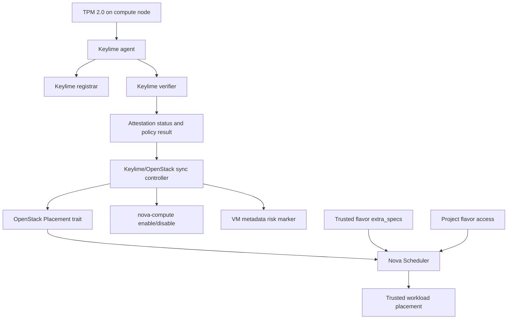

# Keylime + OpenStack 前期案例实现逻辑与实现原理总结

更新时间：2026-07-05

## 1. 总体目标

前期实验的核心目标不是单独部署 Keylime，也不是只在 OpenStack 中创建一个普通调度标签，而是验证一条完整的可信云控制链路：

```text
计算节点 TPM 证据
  -> Keylime 远程证明与策略判定
  -> OpenStack 可识别的可信状态
  -> Nova 调度、计算服务隔离、租户授权、存量 VM 风险标记
```

通过这条链路，OpenStack 不再只根据 CPU、内存、磁盘等资源容量调度虚拟机，也可以根据计算节点的 TPM/Keylime 可信证明结果决定：

```text
哪些节点可以承载可信工作负载
哪些节点应从可信资源池移除
哪些租户可以申请可信计算资源
哪些已有 VM 需要被标记为运行在风险宿主机上
```

## 2. 实验环境中的角色分工

```text
csri10 / 172.31.100.10
  OpenStack controller
  Keylime registrar
  Keylime verifier
  Keylime tenant
  Keylime/OpenStack 同步控制器
  管理系统前端与 API

csri9 / 172.31.100.9
  OpenStack nova-compute
  TPM 2.0
  Keylime agent

csri8 / 172.31.100.8
  OpenStack nova-compute
  TPM 2.0
  Keylime agent
```

关键 OpenStack 对象：

```text
Placement trait:
  CUSTOM_KEYLIME_ATTESTED

可信 flavor:
  trusted.keylime.small
  trusted.keylime.private.small

计算服务:
  nova-compute on csri8/csri9
```

关键 Keylime 对象：

```text
registrar:
  记录和查询 agent 注册信息

verifier:
  周期性验证 agent TPM quote 与策略

tenant:
  查询 verifier 状态，更新 agent 策略，触发 reactivate

agent:
  运行在计算节点上，访问 TPM，响应 quote 请求
```

## 3. 总体架构



这套结构中，Keylime 负责回答“计算节点是否可信”，OpenStack 负责把这个答案落实到云平台行为中。二者之间的桥接层是本实验实现的同步控制器和管理系统。

## 4. Keylime 如何接入 OpenStack

### 4.1 OpenStack resource provider 是什么

OpenStack Placement 服务负责描述云平台中“谁能够提供资源”。在 Placement 模型里，resource provider 是资源供给方对象。对本实验来说，最重要的 resource provider 就是每个 nova-compute 计算节点对应的调度对象，例如：

```text
csri8 nova-compute
  -> Placement resource provider: csri8
  -> 提供 VCPU、MEMORY_MB、DISK_GB 等资源

csri9 nova-compute
  -> Placement resource provider: csri9
  -> 提供 VCPU、MEMORY_MB、DISK_GB 等资源
```

resource provider 不是虚拟机，也不是租户项目，而是 Nova Scheduler 在 Placement 中看到的“资源承载者”。当用户创建虚拟机时，Nova Scheduler 会根据 flavor、镜像、可用区、资源余量、trait 等约束，从这些 resource provider 中选择合适的计算节点。

因此，如果要让 OpenStack 的调度过程理解“某个计算节点当前可信或不可信”，最自然的入口就是更新该计算节点对应 resource provider 的调度属性。

### 4.2 Placement trait 是什么

Placement trait 是挂在 resource provider 上的能力或属性标签。它可以表达一个计算节点具备某种能力，也可以表达一个调度时必须满足的条件。OpenStack 支持标准 trait，也支持自定义 trait；自定义 trait 通常以 `CUSTOM_` 开头。

本实验使用的可信标签是：

```text
CUSTOM_KEYLIME_ATTESTED
```

它的含义不是“这个节点安装了 Keylime”，而是“这个节点最近一次 Keylime 远程证明结果满足当前可信策略”。这个 trait 由同步控制器动态维护：

```text
Keylime 证明通过且结果新鲜
  -> 给对应 resource provider 添加 CUSTOM_KEYLIME_ATTESTED

Keylime 证明失败、过期或 agent 不可达
  -> 从对应 resource provider 移除 CUSTOM_KEYLIME_ATTESTED
```

Nova flavor 可以通过 extra specs 要求某个 trait：

```text
trait:CUSTOM_KEYLIME_ATTESTED=required
```

这样 Nova Scheduler 在调度该 flavor 的虚拟机时，就只会选择当前带有 `CUSTOM_KEYLIME_ATTESTED` 的 resource provider。

### 4.3 Nova flavor 与可信 trait 的关系

Nova flavor 是 OpenStack 创建虚拟机时使用的规格模板。它通常定义虚拟机需要多少 vCPU、内存、磁盘等资源；同时也可以通过 `extra_specs` 定义调度约束。

在本实验中，trusted flavor 不只是普通资源规格，也是一种可信调度模板。例如：

```text
trusted.keylime.small:
  vcpus: 1
  ram: 2048 MB
  disk: 10 GB
  extra_specs:
    trait:CUSTOM_KEYLIME_ATTESTED=required
```

这里最关键的是 `CUSTOM_KEYLIME_ATTESTED` 在两个位置同时出现，但含义不同：

| 位置 | 配置 | 角色 | 含义 |
|---|---|---|---|
| 计算节点对应的 resource provider | `CUSTOM_KEYLIME_ATTESTED` | 供给侧 | 该计算节点当前通过 Keylime/TPM 证明，可以提供可信资源 |
| trusted flavor 的 extra_specs | `trait:CUSTOM_KEYLIME_ATTESTED=required` | 需求侧 | 使用该 flavor 的虚拟机必须调度到可信计算节点 |

二者的关系可以理解为“供给侧标签”和“需求侧约束”的匹配：

```text
Keylime 判断 csri8 可信
  -> 同步控制器给 csri8 的 resource provider 添加 CUSTOM_KEYLIME_ATTESTED

用户使用 trusted.keylime.small 创建虚拟机
  -> flavor 要求 trait:CUSTOM_KEYLIME_ATTESTED=required

Nova Scheduler 执行调度
  -> 只选择带有 CUSTOM_KEYLIME_ATTESTED 的 resource provider
```

如果节点失信，Keylime/OpenStack 同步控制器会移除该节点 resource provider 上的 `CUSTOM_KEYLIME_ATTESTED`。此时 trusted flavor 仍然要求 `trait:CUSTOM_KEYLIME_ATTESTED=required`，但该节点已经不能满足约束，所以 Nova Scheduler 不会把新的可信虚拟机调度到该节点。

也就是说：

```text
只在 resource provider 上添加 trait
  -> 表示节点具备可信供给能力
  -> 但普通 flavor 不一定会要求它

只在 flavor 中要求 trait
  -> 表示虚拟机需要可信节点
  -> 但如果没有节点带该 trait，会调度失败

resource provider trait + flavor required trait 同时存在
  -> Nova Scheduler 才能完成可信节点匹配
```

因此，`给对应 resource provider 添加 CUSTOM_KEYLIME_ATTESTED` 和 `trait:CUSTOM_KEYLIME_ATTESTED=required` 是同一套可信调度机制的两端：前者由 Keylime 证明结果动态驱动，后者由云平台管理员固化到可信 flavor 中，最终由 Nova Scheduler 完成匹配。

### 4.4 如何构建 trusted flavor 上的 required trait

trusted flavor 的构建分为两步：先创建虚拟机规格，再给该规格写入 Placement trait 约束。下面命令表达的是本仓库 `deploy/scripts/keylime-openstack-trusted-flavor-setup.sh` 的核心逻辑。

先加载 OpenStack 管理员环境和基础变量：

```bash
source /etc/keylime-openstack-sync/openstack-keylime-lab.env
source "$OPENRC"

DOMAIN="${DOMAIN:-Default}"
SOURCE_FLAVOR="${SOURCE_FLAVOR:-m1.small}"
TRUSTED_PROJECT="${TRUSTED_PROJECT:-proj-boundary-a}"
PUBLIC_TRUSTED_FLAVOR="${PUBLIC_TRUSTED_FLAVOR:-trusted.keylime.small}"
PRIVATE_TRUSTED_FLAVOR="${PRIVATE_TRUSTED_FLAVOR:-trusted.keylime.private.small}"
TRUSTED_TRAIT="${TRUSTED_TRAIT:-CUSTOM_KEYLIME_ATTESTED}"
```

从已有普通 flavor 读取资源规格，保证 trusted flavor 的 CPU、内存、磁盘规格与基准 flavor 一致：

```bash
FLAVOR_RAM="$(openstack flavor show "$SOURCE_FLAVOR" -f value -c ram)"
FLAVOR_DISK="$(openstack flavor show "$SOURCE_FLAVOR" -f value -c disk)"
FLAVOR_VCPUS="$(openstack flavor show "$SOURCE_FLAVOR" -f value -c vcpus)"
```

创建 public trusted flavor，并写入 required trait：

```bash
openstack flavor create "$PUBLIC_TRUSTED_FLAVOR" \
  --public \
  --id auto \
  --ram "$FLAVOR_RAM" \
  --disk "$FLAVOR_DISK" \
  --vcpus "$FLAVOR_VCPUS"

openstack flavor set "$PUBLIC_TRUSTED_FLAVOR" \
  --property "trait:${TRUSTED_TRAIT}=required"
```

创建 private trusted flavor，并只授权给指定项目使用：

```bash
openstack flavor create "$PRIVATE_TRUSTED_FLAVOR" \
  --private \
  --id auto \
  --ram "$FLAVOR_RAM" \
  --disk "$FLAVOR_DISK" \
  --vcpus "$FLAVOR_VCPUS"

openstack flavor set "$PRIVATE_TRUSTED_FLAVOR" \
  --property "trait:${TRUSTED_TRAIT}=required"

openstack flavor set "$PRIVATE_TRUSTED_FLAVOR" \
  --project "$TRUSTED_PROJECT" \
  --project-domain "$DOMAIN"
```

验证 flavor 是否已经具备可信调度约束：

```bash
openstack flavor show "$PUBLIC_TRUSTED_FLAVOR" \
  -c name \
  -c properties \
  -f yaml

openstack flavor show "$PRIVATE_TRUSTED_FLAVOR" \
  -c name \
  -c os-flavor-access:is_public \
  -c access_project_ids \
  -c properties \
  -f yaml
```

期望看到：

```yaml
properties:
  trait:CUSTOM_KEYLIME_ATTESTED: required
```

这里的 `trait:CUSTOM_KEYLIME_ATTESTED=required` 是写在 flavor 上的需求侧约束。它不会主动改变任何计算节点状态，只是在调度时要求候选 resource provider 必须带有 `CUSTOM_KEYLIME_ATTESTED`。

### 4.5 如何添加或删除 resource provider 上的 trusted trait

resource provider 上的 `CUSTOM_KEYLIME_ATTESTED` 是供给侧标签，由 Keylime/OpenStack 同步控制器根据证明结果动态维护。实际对应的脚本是 `deploy/scripts/keylime-placement-sync.sh`。

首先根据计算节点名称找到 Placement resource provider：

```bash
source /etc/keylime-openstack-sync/openstack-keylime-lab.env
source "$OPENRC"
export OS_PLACEMENT_API_VERSION=1.17

RP_NAME="${RP_NAME:-csri8}"
TRUSTED_TRAIT="${TRUSTED_TRAIT:-CUSTOM_KEYLIME_ATTESTED}"

RP_UUID="$(openstack resource provider list --name "$RP_NAME" -f value -c uuid)"
openstack resource provider trait list "$RP_UUID"
```

添加 `CUSTOM_KEYLIME_ATTESTED` 时不能简单地只执行：

```bash
openstack resource provider trait set --trait "$TRUSTED_TRAIT" "$RP_UUID"
```

原因是 `resource provider trait set` 是全量替换，不是追加。如果该 resource provider 原本还有其他 traits，上面的写法会把其他 traits 覆盖掉。生产化脚本应先读取已有 traits，再合并新 trait：

```bash
traits="$(openstack resource provider trait list "$RP_UUID" -f value -c name || true)"

cmd=(openstack resource provider trait set)
while IFS= read -r t; do
  [ -n "$t" ] && cmd+=(--trait "$t")
done < <(printf '%s\n' "$traits")

cmd+=(--trait "$TRUSTED_TRAIT")
cmd+=("$RP_UUID")
"${cmd[@]}"
```

删除 `CUSTOM_KEYLIME_ATTESTED` 也同理，不能误删其他 traits。正确做法是读取已有 traits，过滤掉可信 trait，再把剩余 traits 重新写回：

```bash
traits="$(openstack resource provider trait list "$RP_UUID" -f value -c name || true)"

cmd=(openstack resource provider trait set)
while IFS= read -r t; do
  [ -z "$t" ] && continue
  [ "$t" = "$TRUSTED_TRAIT" ] && continue
  cmd+=(--trait "$t")
done < <(printf '%s\n' "$traits")

cmd+=("$RP_UUID")
"${cmd[@]}"
```

验证 resource provider 当前是否带可信 trait：

```bash
openstack resource provider trait list "$RP_UUID" | grep "$TRUSTED_TRAIT" || \
  echo "MISSING: $TRUSTED_TRAIT"
```

这部分在实验系统中的自动化关系是：

```text
Keylime verifier 返回 PASS_FRESH
  -> keylime-placement-sync.sh 安全合并 CUSTOM_KEYLIME_ATTESTED
  -> trusted flavor 可以调度到该 compute

Keylime verifier 返回 NOT_PASS / 证明过期 / agent 不可达
  -> keylime-placement-sync.sh 安全移除 CUSTOM_KEYLIME_ATTESTED
  -> trusted flavor 不能再调度到该 compute
```

因此，trusted flavor 的 required trait 是相对稳定的策略配置；resource provider 上的 trusted trait 是随 Keylime/TPM 证明结果变化的实时状态。

### 4.6 为什么可以通过 Placement 将 OpenStack 与 Keylime 结合

Keylime 擅长回答“计算节点是否可信”，但 OpenStack 原生调度并不会直接理解 TPM quote、PCR 策略、Keylime verifier 状态。Placement 则是 Nova 调度已经使用的资源与属性接口。将 Keylime 判断结果转换成 Placement trait，相当于把外部可信证明结果翻译成 OpenStack 调度系统原本就能消费的语言。

这种结合方式有几个关键优点：

```text
不需要修改 Nova Scheduler 源码
使用 OpenStack 原生 resource provider / trait / flavor extra_specs 机制
可信状态可以随 Keylime 证明结果动态变化
可信调度、项目隔离、计算服务隔离可以组合使用
```

所以，本实验的核心不是让 OpenStack 直接处理 TPM 细节，而是让 Keylime 专门处理 TPM 证据和策略判断，再由同步控制器把判断结果写入 Placement。OpenStack 随后基于这些 trait 完成可信调度。

### 4.7 从 Keylime 状态到 OpenStack trait

Keylime verifier 对每个计算节点 agent 给出证明状态。同步脚本通过 `keylime-tenant -c status` 查询 verifier 结果，并生成决策文件：

```text
/var/log/keylime-openstack-sync-decision.json
/var/log/keylime-openstack-sync-decision-csri8.json
/var/log/keylime-openstack-sync-decision-csri9.json
```

决策不是简单使用 `PASS`，而是进一步判断为 `PASS_FRESH`：

```text
attestation_status == PASS
operational_state 不处于 Failed/Terminated
last_successful_attestation 可解析
last_successful_attestation 未超过 freshness 阈值
```

只有满足上述条件，控制器才认为节点当前可信。

可信时：

```text
给对应 OpenStack resource provider 添加 CUSTOM_KEYLIME_ATTESTED
```

不可信或证明过期时：

```text
从对应 OpenStack resource provider 移除 CUSTOM_KEYLIME_ATTESTED
```

这样 Keylime 的证明结果被转换成 Nova Scheduler 可以消费的 Placement trait。

### 4.8 OpenStack 如何消费 Keylime 可信状态

可信 flavor 通过 extra specs 要求 Placement trait：

```text
trait:CUSTOM_KEYLIME_ATTESTED=required
```

Nova Scheduler 在调度使用该 flavor 的虚拟机时，只会选择带有 `CUSTOM_KEYLIME_ATTESTED` 的 resource provider。由此实现：

```text
Keylime 证明通过的 compute host
  -> trait 存在
  -> 可以承载 trusted flavor

Keylime 证明失败或过期的 compute host
  -> trait 被移除
  -> trusted flavor 无法调度到该 host
```

这就是 Keylime 赋能 OpenStack 调度面的核心机制。

## 5. TPM 在本实验中实际发挥的作用

### 5.1 TPM quote

Keylime verifier 通过 agent 获取 TPM quote。quote 用于证明：

```text
agent 背后确实有 TPM 参与
PCR 值来自 TPM 度量状态
quote 与 verifier 发起的挑战关联
```

这避免了只靠普通软件心跳来声明“节点可信”的问题。

### 5.2 PCR 策略

实验从空策略逐步升级到 TPM PCR 策略。当前稳定用于准入判断的是 SHA256 PCR7：

```text
PCR7 = AD69DC884387BB14056F05ABC4AB0B8AA751824D909931618FB6365EE2C2938D
```

Keylime verifier 只有在 agent 返回的 quote 满足 PCR 策略时才会给出可信结果。这样 OpenStack 中的 `CUSTOM_KEYLIME_ATTESTED` 不再只是“agent 在线”，而是包含了 TPM PCR 策略匹配的含义。

### 5.3 TPM evidence baseline

实验采集了 csri8/csri9 的 TPM 证据基线，包括：

```text
TPM variable/fixed properties
SHA256 PCR 0-7
SHA1/SHA256 PCR bank 状态
Secure Boot 相关状态
measured boot event log 是否存在
IMA ascii/binary log 是否存在
Keylime agent 容器状态
```

基于 baseline 自动生成策略：

```text
<host>-sha256-pcr7-baseline
<host>-sha256-pcr0-7-exact
```

生产化管理系统默认绑定 PCR7 baseline。PCR0-7 exact policy 作为已采集的启动度量材料保存在策略库和审计文件中，用于解释更完整的启动度量状态。

### 5.4 Freshness 防止历史 PASS 被滥用

实验中不只检查 `attestation_status=PASS`，还检查最近一次成功证明时间：

```text
last_successful_attestation_age_seconds <= MAX_ATTESTATION_AGE_SECONDS
```

这解决了一个重要问题：节点不能因为过去曾经 PASS，就长期被 OpenStack 当作可信节点。Keylime 证明必须是当前且新鲜的，OpenStack trait 才会被保留。

## 6. 已实现的 OpenStack 安全可信能力

### 6.1 可信调度

通过 Placement trait 和 trusted flavor，OpenStack 获得了基于 Keylime/TPM 结果的调度能力：

```text
可信节点进入 trusted compute pool
失信节点退出 trusted compute pool
trusted flavor 只能调度到可信节点
```

这把 TPM 证明结果落实到了 Nova Scheduler。

### 6.2 项目级可信资源授权

实验创建了 public trusted flavor 和 private trusted flavor。private trusted flavor 只授权给指定 project：

```text
trusted.keylime.private.small
  -> 仅授权给 proj-boundary-a
```

这样 OpenStack project 负责租户边界，Keylime/TPM 负责宿主机可信边界。二者结合后形成：

```text
谁有资格申请可信资源
  -> OpenStack private flavor/project access 控制

哪些节点可以提供可信资源
  -> Keylime/TPM/Placement trait 控制
```

### 6.3 失信节点隔离

当 Keylime 判定节点不是 `PASS_FRESH`，控制器执行两层动作：

```text
移除 CUSTOM_KEYLIME_ATTESTED
禁用对应 nova-compute service
```

移除 trait 会阻止 trusted flavor 调度到该节点；禁用 nova-compute 则进一步阻止普通新负载继续调度到该计算服务。

恢复时，控制器只会重新启用由 Keylime 控制器自己禁用过的 compute service。它通过 marker 文件区分：

```text
/var/lib/keylime-openstack-sync/<host>.nova-compute.disabled-by-keylime
```

如果没有 marker，说明禁用状态可能来自人工运维，控制器不会擅自覆盖管理员状态。

### 6.4 可信计算池动态收缩与恢复

csri8/csri9 都接入后，可信计算池变成动态资源池：

```text
两个节点均 PASS_FRESH
  -> 两个节点都有 CUSTOM_KEYLIME_ATTESTED
  -> trusted workload 可在两个节点之间调度

某个节点证明失败或过期
  -> 该节点 trait 被移除
  -> nova-compute 被禁用
  -> trusted workload 自动避开该节点

节点恢复 PASS_FRESH
  -> trait 恢复
  -> nova-compute 可恢复
  -> 节点重新进入可信池
```

这证明 Keylime 不只是做一次性验收，而是可以持续驱动 OpenStack 可信资源池的收缩和恢复。

### 6.5 存量 VM 风险标记

调度控制只能影响新建 VM。对于已经运行在失信 host 上的 VM，实验实现了 metadata 标记：

```text
keylime_trust_state=host_untrusted
keylime_trust_host=<host>
keylime_trust_reason=<reason>
keylime_trust_checked_at=<timestamp>
```

当 host 恢复可信后，控制器自动清理这些 metadata。这样 OpenStack 不仅能阻止新工作负载调度，还能识别已经受影响的存量 VM。

## 7. 多节点纳管逻辑

实验从单节点 csri9 扩展到 csri8/csri9 多节点。核心问题是建立 OpenStack compute host 与 Keylime agent 的映射。

配置来源包括：

```text
KEYLIME_AGENT_HOSTS
KEYLIME_AGENT_IP_MAP
KEYLIME_AGENT_UUID_MAP
Keylime registrar reglist
OpenStack nova-compute service list
OpenStack hypervisor list
```

控制器每轮执行时：

```text
1. 自动识别 OpenStack nova-compute 节点
2. 刷新 Keylime agent inventory
3. 为每个 host 找到 agent UUID/IP
4. 分别查询 Keylime verifier 状态
5. 分别生成 per-host decision 文件
6. 分别同步 Placement trait 和 nova-compute 状态
```

因此，即使某个 OpenStack compute 节点暂时没有 Keylime agent，管理系统也可以显示它，并标记为未装代理，而不是把它从监控视图中遗漏。

## 8. 管理系统的作用

管理系统不是单纯展示页面，而是前期能力的可视化入口和控制面：

```text
计算节点可信状态监控
  -> 展示 OpenStack compute 节点
  -> 展示 IP、VM 数量、可信状态、服务状态
  -> 区分可信、不可信、未安装 agent

TPM PCR 策略管理
  -> 查看 TPM evidence baseline
  -> 从 baseline 导入 PCR 策略
  -> 按节点绑定策略
  -> 统一下发或单节点下发生产策略
```

管理系统读取的不是单一来源，而是聚合：

```text
OpenStack compute service list
OpenStack hypervisor list
OpenStack server list
OpenStack resource provider trait list
Keylime decision JSON
TPM evidence baseline JSON
PCR policy store JSON
VM risk marker audit JSON
```

这样用户可以从一个界面看到 Keylime 可信状态如何影响 OpenStack 资源状态。

## 9. 自动化运行链路

前期能力已经统一接入 systemd：

```text
keylime-openstack-monitor.service
  -> trust_monitor_server.py
  -> 管理系统前端与 API

keylime-openstack-sync.timer
  -> keylime-sync-control-loop.sh
  -> keylime-agent-inventory-refresh.sh
  -> keylime-placement-sync.sh
  -> keylime-nova-compute-quarantine.sh
  -> keylime-vm-risk-marker.sh
```

控制循环的核心顺序是：

```text
刷新 agent inventory
  -> 逐节点查询 Keylime verifier
  -> 生成 decision
  -> 同步 Placement trait
  -> 同步 nova-compute quarantine
  -> 标记或清理 VM metadata
```

这使前期案例不再只是手动实验命令，而是形成了持续运行的可信控制链。

## 10. 前期实验形成的关键原则

### 10.1 Keylime 负责证明，OpenStack 负责执行

Keylime 不直接调度 VM，也不直接管理 OpenStack project。它提供可信判定。OpenStack 根据这个判定执行调度、隔离、授权和 metadata 标记。

### 10.2 TPM 证据必须转化为云平台原生对象

TPM PCR、quote、freshness 等概念不能停留在 Keylime 内部。实验把它们转化为 OpenStack 原生对象：

```text
Placement trait
flavor extra specs
compute service status
server metadata
policy store
audit JSON
```

因此可信状态可以被 Nova Scheduler、管理员和租户侧流程使用。

### 10.3 可信状态必须持续刷新

可信不是一次性标签，而是周期性证明结果。实验通过 freshness、systemd timer、per-host decision 文件实现持续刷新，避免历史可信状态长期残留。

### 10.4 隔离动作必须尊重人工运维边界

控制器只恢复自己禁用的 nova-compute，不覆盖管理员手动禁用的状态。这通过 marker 文件实现，避免自动化系统破坏人工运维决策。

### 10.5 生产管理系统只暴露安全操作

新版管理系统保留策略导入、策略绑定、标准下发等生产操作，不暴露破坏性策略下发或负向验证入口。测试型能力可以存在于案例记录中，但不应成为日常控制台功能。

## 11. 能力映射表

| TPM/Keylime 能力 | OpenStack 落点 | 形成的安全可信能力 |
| --- | --- | --- |
| TPM quote | Keylime verifier status | 证明计算节点不是普通软件自声明可信 |
| SHA256 PCR7 policy | Placement trait | 只有启动度量符合策略的节点进入可信池 |
| Attestation freshness | Trait 保留/移除 | 防止历史 PASS 被长期复用 |
| Keylime verifier FAIL/STALE | nova-compute disable | 失信节点隔离，阻止新负载进入 |
| Agent inventory | compute host 到 agent UUID 映射 | 多计算节点统一纳管 |
| TPM evidence baseline | PCR policy store | 策略可生成、可绑定、可审计 |
| Keylime decision JSON | 管理系统/API | 可信状态可观测、可追踪 |
| Host trust result | VM metadata | 存量 VM 风险可标记、可清理 |
| Project flavor access | private trusted flavor | 可信资源只开放给授权租户 |

## 12. 总结

前期实验已经完成了一条闭环：

```text
TPM 提供硬件度量与 quote
Keylime 根据 TPM 证据和 PCR 策略判断计算节点可信状态
同步控制器把 Keylime 判断转换成 OpenStack 原生控制对象
OpenStack 根据这些对象完成可信调度、可信资源授权、失信节点隔离和存量 VM 风险标记
管理系统把上述状态与策略操作集中展示和管理
```

这说明 Keylime 在 OpenStack 中的价值不是“额外部署一个证明服务”，而是把 TPM 可信根和远程证明结果转化为云平台可执行的安全控制能力。
