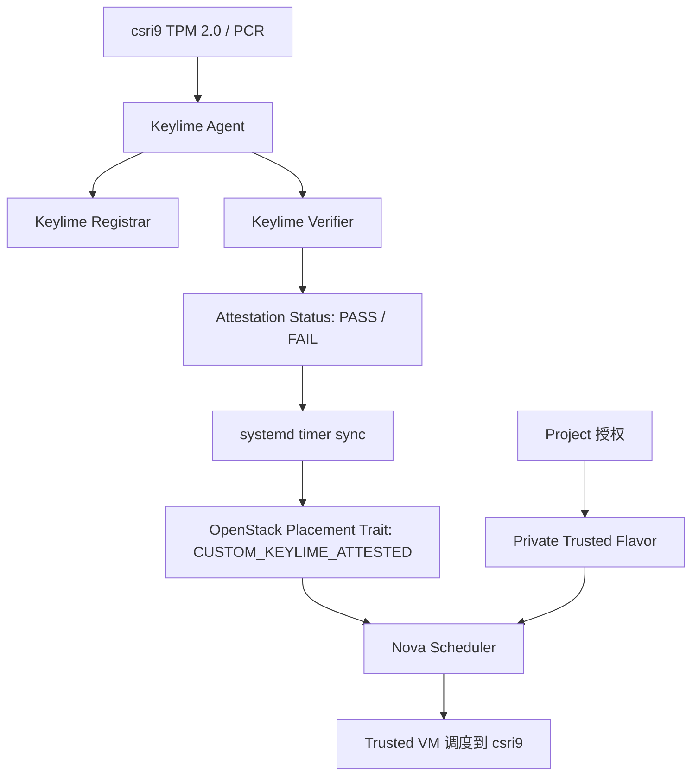

# 案例总结：OpenStack 与 Keylime 结合实现可信云调度与 Project 授权

日期：2026-07-02

## 1. 案例背景

本案例的目标不是简单部署 Keylime，而是验证：

```text
Keylime 的可信计算能力，能否真正进入 OpenStack 云平台，
并影响虚拟机调度、租户授权和可信资源申请。
```

实验前，OpenStack 原生 `project` 已经验证出以下边界：

```text
project 能隔离用户、Token、资源归属、网络可见性、配额和策略。
project 不能证明宿主机是否可信。
project 也不能天然保证某个虚拟机会运行在可信计算节点上。
```

因此，本案例引入 Keylime，将宿主机 TPM/attestation 状态转换为 OpenStack 可识别的调度条件。

## 2. 实验环境

OpenStack 环境：

```text
部署方式：Kolla / Docker
OpenStack 版本：2026.1

控制节点：
  csri10
  172.31.100.10

计算节点：
  csri9
  172.31.100.9
  TPM 2.0 可用，SHA256 PCR bank 可读

  csri8
  172.31.100.8
  TPM 2.0 存在，但 SHA256 PCR bank 未启用，本案例暂不接入可信池
```

Keylime 环境：

```text
Keylime registrar:
  csri10
  quay.io/keylime/keylime_registrar:v7.14.2
  port: 8890 / 8891

Keylime verifier:
  csri10
  quay.io/keylime/keylime_verifier:v7.14.2
  port: 8881

Keylime tenant:
  csri10
  quay.io/keylime/keylime_tenant:v7.14.2

Keylime agent:
  csri9
  quay.io/keylime/keylime_agent:latest
  port: 9002
  UUID: 11111111-1111-4111-8111-000000000009
```

OpenStack 可信资源：

```text
Placement trait:
  CUSTOM_KEYLIME_ATTESTED

Public trusted flavor:
  trusted.keylime.small

Private trusted flavor:
  trusted.keylime.private.small

Private flavor 授权 project:
  proj-boundary-a
  project_id: 2163706352a5401b8b1b1ec2a2dbb134
  user: alice-a

未授权普通 project:
  proj-boundary-b
  project_id: 117d508a1cba4826af99a7183d6ba784
  user: bob-b
```

## 3. 总体架构



本案例建立的核心链路：

```text
TPM/PCR 可信证明
  -> Keylime verifier 判断宿主机可信状态
  -> 同步脚本将可信状态写入 Placement trait
  -> Nova 通过 flavor extra specs 使用 trait 进行调度
  -> Project 通过 private flavor 授权控制谁能申请可信资源
```

## 4. 阶段 1：Keylime Attestation 接入 Placement Trait

### 4.1 目标

将 Keylime 的验证结果转换为 OpenStack Placement trait：

```text
Keylime PASS
  -> csri9 添加 CUSTOM_KEYLIME_ATTESTED

Keylime FAIL
  -> csri9 移除 CUSTOM_KEYLIME_ATTESTED
```

### 4.2 实现方式

在 `csri10` 上部署同步脚本：

```text
/opt/keylime-openstack-sync/keylime-placement-sync.sh
/opt/keylime-openstack-sync/keylime-placement-sync-locked.sh
```

通过 systemd timer 周期执行：

```text
keylime-openstack-sync.service
keylime-openstack-sync.timer
```

同步周期：

```text
OnUnitActiveSec=30s
```

### 4.3 验证结果

Keylime PASS 时：

```text
CUSTOM_KEYLIME_ATTESTED 存在于 csri9 resource provider
```

trusted flavor 设置：

```yaml
trait:CUSTOM_KEYLIME_ATTESTED: required
```

创建 trusted VM 后，虚拟机成功调度到：

```text
csri9
```

反向验证中，移除 trait 后创建 trusted VM，Nova 返回：

```text
No valid host was found.
```

### 4.4 阶段 1 结论

阶段 1 证明：

```text
Keylime 的可信状态可以通过 Placement trait 进入 Nova 调度路径。
OpenStack 调度结果不再只依赖资源容量，也可以依赖宿主机可信状态。
```

## 5. 阶段 1 增强：PCR 策略

### 5.1 目标

最初 Keylime PASS 主要证明 agent 与 TPM quote 通路可用。为了让可信判断更有意义，本阶段将空策略升级为 PCR 策略。

使用 `csri9` 的 PCR7 作为可信基线：

```text
PCR7 = AD69DC884387BB14056F05ABC4AB0B8AA751824D909931618FB6365EE2C2938D
```

Keylime 策略包含：

```json
{
  "7": [
    "ad69dc884387bb14056f05abc4ab0b8aa751824d909931618fb6365ee2c2938d"
  ],
  "mask": "0x80"
}
```

### 5.2 验证结果

正确 PCR 策略：

```text
attestation_status = PASS
CUSTOM_KEYLIME_ATTESTED 保留
trusted VM 可以调度到 csri9
```

错误 PCR 策略：

```text
attestation_status != PASS
CUSTOM_KEYLIME_ATTESTED 被移除
trusted VM 无法调度
```

### 5.3 阶段 1 增强结论

此时 `CUSTOM_KEYLIME_ATTESTED` 的语义从：

```text
Keylime agent 在线
```

升级为：

```text
宿主机 PCR 状态符合预定义可信基线
```

## 6. 阶段 2：引入 Attestation Freshness

### 6.1 目标

解决“曾经 PASS 不等于现在可信”的问题。

同步脚本从只判断：

```text
attestation_status == PASS
```

升级为判断：

```text
attestation_status == PASS
operational_state 不是 Failed / Terminated
last_successful_attestation 存在
last_successful_attestation 未超过 freshness 阈值
```

实验 freshness 阈值：

```text
120 秒
```

### 6.2 正向结果

Keylime 正常时，决策日志显示：

```json
{
  "attestation_status": "PASS",
  "operational_state": "Get Quote",
  "last_successful_attestation_age_seconds": 2,
  "max_attestation_age_seconds": 120,
  "reason": "PASS_AND_FRESH",
  "result": "PASS_FRESH"
}
```

同步脚本行为：

```text
Keylime status PASS_FRESH: ensure CUSTOM_KEYLIME_ATTESTED on csri9
```

### 6.3 反向结果

停止 `csri9` 的 Keylime agent 后，Keylime 状态变为：

```json
{
  "attestation_status": "FAIL",
  "operational_state": "Failed",
  "last_event_id": "internal.verifier.not_reachable",
  "last_successful_attestation_age_seconds": 168,
  "max_attestation_age_seconds": 120,
  "reason": "ATTESTATION_STATUS_NOT_PASS",
  "result": "NOT_PASS"
}
```

OpenStack 侧验证：

```text
OK: freshness 失效后 trait 已移除
```

恢复 agent 并 reactivate 后，Keylime 重新变为：

```json
{
  "attestation_status": "PASS",
  "operational_state": "Get Quote",
  "last_successful_attestation_age_seconds": 2,
  "reason": "PASS_AND_FRESH",
  "result": "PASS_FRESH"
}
```

trait 恢复：

```text
CUSTOM_KEYLIME_ATTESTED
```

### 6.4 阶段 2 结论

阶段 2 证明：

```text
OpenStack 不再使用历史可信状态。
只有 Keylime 当前 PASS 且 attestation 结果仍然新鲜时，csri9 才会被标记为可信计算节点。
```

此时 `CUSTOM_KEYLIME_ATTESTED` 的语义升级为：

```text
宿主机最近一次 Keylime attestation 成功，且结果仍在有效时间窗口内。
```

## 7. 阶段 3：Trusted Flavor 私有化与 Project 授权

### 7.1 目标

将可信计算能力从“管理员实验能力”升级为“按 project 授权的云资源能力”。

设计如下：

```text
trusted.keylime.private.small
  private flavor
  只授权给 proj-boundary-a
  不授权给 proj-boundary-b
  仍然要求 trait:CUSTOM_KEYLIME_ATTESTED=required
```

### 7.2 Flavor 权限验证

私有 flavor 状态：

```yaml
name: trusted.keylime.private.small
os-flavor-access:is_public: false
access_project_ids:
- 2163706352a5401b8b1b1ec2a2dbb134
properties:
  trait:CUSTOM_KEYLIME_ATTESTED: required
```

普通 project `proj-boundary-b` 验证：

```text
OK: ordinary project cannot see private trusted flavor
```

### 7.3 可信 project 正向验证

`alice-a / proj-boundary-a` 创建虚拟机：

```text
VM name: trusted-private-allow-a
VM id: 2c4098fc-1dc2-475a-bf8f-3d483f3a21cd
Flavor: trusted.keylime.private.small
Project: proj-boundary-a
Status: ACTIVE
Host: csri9
```

服务器详情显示：

```yaml
OS-EXT-SRV-ATTR:host: csri9
flavor:
  extra_specs:
    trait:CUSTOM_KEYLIME_ATTESTED: required
  name: trusted.keylime.private.small
project_id: 2163706352a5401b8b1b1ec2a2dbb134
status: ACTIVE
```

### 7.4 可信 project 但 Keylime 失效时的反向验证

停止 Keylime agent 并移除 trait 后，`alice-a / proj-boundary-a` 再次创建 trusted VM：

```text
VM name: trusted-private-keylime-fail-a
VM id: 19bbbc75-36ec-495f-82b3-5f1b3cc9bc48
Flavor: trusted.keylime.private.small
Project: proj-boundary-a
Status: ERROR
```

该结果证明：

```text
project 授权只表示“可以申请可信 flavor”。
是否能真正调度成功，仍取决于当前是否存在 Keylime 持续可信的计算节点。
```

### 7.5 阶段 3 结论

阶段 3 证明：

```text
Project 控制谁能申请可信计算资源。
Flavor 表达 workload 对可信宿主机的需求。
Keylime/Placement 决定当前有哪些宿主机真的可信。
Nova Scheduler 将三者合并为最终调度结果。
```

## 8. 本案例最终达成的结果

### 8.1 已经达成的安全能力

本案例已经实现：

```text
1. 宿主机 TPM/Keylime attestation 接入 OpenStack。
2. Keylime PASS/FAIL 能自动影响 Placement trait。
3. Nova trusted flavor 能强制要求可信宿主机。
4. systemd timer 能持续同步可信状态。
5. freshness 机制能防止历史 PASS 长期保留可信标记。
6. private flavor 能把可信计算能力只授权给指定 project。
7. 未授权 project 看不到也不能使用 trusted flavor。
8. 授权 project 在 Keylime 失效时仍无法创建 trusted VM。
```

### 8.2 实验形成的可信云控制链

```text
Project 边界：
  proj-boundary-a 可以申请 trusted flavor
  proj-boundary-b 不可以申请 trusted flavor

Flavor 边界：
  trusted.keylime.private.small 必须要求 CUSTOM_KEYLIME_ATTESTED

Keylime 边界：
  只有 PCR 策略匹配且 freshness 未过期的计算节点才算可信

Placement 边界：
  只有有 CUSTOM_KEYLIME_ATTESTED 的 resource provider 可被选中

Nova 调度边界：
  没有可信 host 时返回 No valid host / VM ERROR
```

### 8.3 案例核心结论

本案例证明：

```text
OpenStack project 负责租户和资源授权边界；
Keylime 负责宿主机可信状态证明；
Placement trait 是二者结合的关键桥梁；
Nova Scheduler 是可信策略最终执行点。
```

因此，可信云不是单独由 Keylime 或 OpenStack 完成，而是由以下链路共同完成：

```text
可信证明
  -> 策略判断
  -> 云平台资源表达
  -> 调度强制执行
  -> 租户授权控制
  -> 失信自动阻断
```

## 9. 实验中遇到的问题与处理

### 9.1 OpenStack CLI 环境问题

在 `kolla_toolbox` 内使用：

```bash
export OS_CLIENT_CONFIG_FILE=/etc/kolla/clouds.yaml
export OS_CLOUD=admin
```

出现：

```text
Cloud admin was not found.
```

处理方式：

```text
在 csri10 宿主机直接 source /etc/kolla/admin-openrc.sh。
```

### 9.2 Keylime 镜像版本问题

`latest` registrar/verifier 镜像出现配置文件问题，切换为：

```text
quay.io/keylime/keylime_registrar:v7.14.2
quay.io/keylime/keylime_verifier:v7.14.2
quay.io/keylime/keylime_tenant:v7.14.2
```

但 `keylime_agent:v7.14.2` 不存在，因此 agent 暂用：

```text
quay.io/keylime/keylime_agent:latest
```

### 9.3 Agent 容器启动问题

遇到的问题包括：

```text
entrypoint 不正确
registrar_ip 未加引号导致配置解析失败
/var/lib/keylime/actions 缺失
/dev/tpmrm0 权限不足
tenant mTLS CA 未被 agent 信任
TPM NVRAM 中无 EK certificate
```

处理后 agent 成功：

```text
SUCCESS: Agent 11111111-1111-4111-8111-000000000009 activated
Listening on https://0.0.0.0:9002
```

### 9.4 Freshness 解析问题

Keylime 输出中的：

```json
"last_successful_attestation": 1783002336
```

是数字时间戳，而不是字符串。

初版脚本只匹配字符串，导致误判：

```text
MISSING_OR_UNPARSEABLE_LAST_SUCCESSFUL_ATTESTATION
```

修复后脚本能识别数字时间戳，并正确输出：

```text
PASS_FRESH
```

### 9.5 跨 project 查询 VM

当前 OpenStackClient 支持：

```bash
openstack server list --all-projects
```

但不支持：

```bash
openstack server show --all-projects
```

处理方式：

```text
先用 server list --all-projects 找到 VM ID，
再用 openstack server show <id> 查询详情。
```

## 10. 当前仍然存在的实验性不足

本案例已经证明了核心链路，但距离生产级可信云仍有差距：

```text
1. 同步脚本仍使用 admin-openrc.sh，未做到最小权限。
2. keylime-agent 使用 latest 镜像，版本未完全固定。
3. agent 容器使用 privileged 和 TPM 设备宽权限，不适合生产。
4. 当前主要使用 PCR7 策略，尚未引入 measured boot policy。
5. 尚未启用 IMA runtime integrity 检测运行时文件篡改。
6. 暂未校验 EK certificate / 平台证书链。
7. 只接入 csri9，csri8 因 SHA256 PCR bank 未启用暂未纳入。
8. 失信后只阻断新调度，尚未处理已运行 VM 的告警、隔离或迁移。
9. 同步脚本通过 keylime-tenant CLI 获取状态，后续应改为直接调用 verifier API。
```

## 11. 后续演进方向

建议下一阶段继续做：

```text
1. 最小权限 OpenStack 账号替代 admin-openrc.sh。
2. 直接调用 Keylime verifier REST API 和 OpenStack Placement API。
3. 引入 measured boot policy，验证启动链可信。
4. 引入 IMA runtime policy，验证运行时文件完整性。
5. 将单一 CUSTOM_KEYLIME_ATTESTED 拆成多级可信 trait。
6. 修复 csri8 的 SHA256 PCR bank 后接入多节点可信池。
7. 增加失信节点告警、隔离、禁用 nova-compute、host aggregate 调整。
8. 将 trusted flavor、image metadata、project policy 结合成完整可信云产品能力。
```

## 12. 案例最终一句话总结

本案例完成了从“OpenStack 只有租户边界”到“OpenStack 能消费 Keylime 可信证明”的关键跨越：

```text
Keylime 负责证明宿主机可信，
OpenStack Project 负责控制谁能申请可信资源，
OpenStack Placement/Nova 负责保证可信资源只能落到可信宿主机。
```


