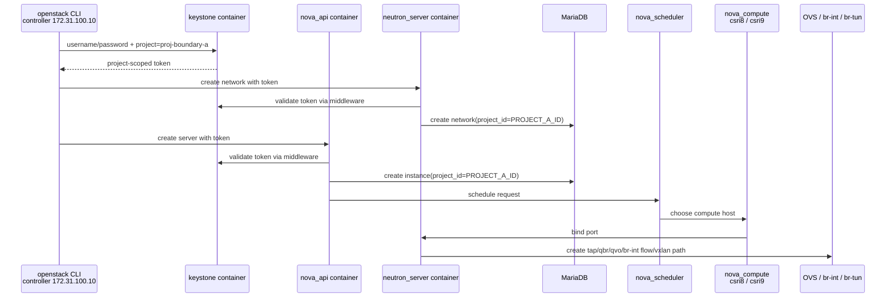

# OpenStack Project 原理与边界实验环境方案

日期：2026-07-02

## 1. 实验目标

你的环境是三节点 Docker 化 OpenStack：

| 节点 | IP | 建议角色 | 说明 |
|---|---:|---|---|
| `csri10` | `172.31.100.10/24` | 控制/API 节点 | 已确认运行 `keystone`、`nova_api`、`nova_scheduler`、`neutron_server`、`placement_api`、`glance_api`、`rabbitmq`、`mariadb`。同时有 `172.31.100.100` 和 `172.31.107.100` 两个额外地址，`172.31.100.100` 很可能是 Kolla 内部/API VIP。 |
| `csri8` | `172.31.100.8/24` | 计算节点 | 已确认运行 `nova_compute`、`nova_libvirt`、`neutron_openvswitch_agent`、Open vSwitch。附件显示该节点已有 `br-int`、`br-tun`、VXLAN 和 tap/qbr/qvo 设备。 |
| `csri9` | `172.31.100.9/24` | 计算节点 | 已通过 `openstack compute service list` 确认存在 `nova-compute` 服务，状态为 `enabled/up`。 |

已确认的控制面与计算面：

```text
controller/API: csri10
compute:        csri8, csri9
admin project:  admin
service project: service
existing project: 云评估
admin openrc:   /etc/kolla/admin-openrc.sh
clouds.yaml:    /etc/kolla/clouds.yaml
toolbox cloud:  /etc/kolla/kolla-toolbox/clouds.yaml
```

本实验要回答三个问题：

1. **什么是 project？**  
   Project 是 Keystone 中的身份与资源隔离容器。它通常对应租户、团队、业务系统或账号空间。

2. **Project 的边界在哪里？**  
   边界不只在 Keystone。它由 Keystone role assignment、project-scoped token、各服务 policy、服务数据库中的 `project_id`、quota、资源可见性和共享机制共同形成。

3. **Project 边界的原理是什么？**  
   用户拿到某个 project 的 scoped token 后，请求 Nova/Neutron/Cinder/Glance 等服务；服务通过 keystonemiddleware 校验 token，再用 policy 和资源 `project_id` 判断是否允许访问。

官方文档中，Keystone 把 project 定义为用于分组或隔离资源/身份对象的容器；角色的含义由各服务通过 policy 解释。Keystone 支持 project-scoped token；OpenStack 服务通常用 keystonemiddleware 验证 token 并向服务应用传递身份上下文。Nova flavor 支持 private flavor 和 required traits；Neutron RBAC 支持把资源授权给特定 project；Nova quota 可以按 project 查看和设置。

## 2. 总体实验思路

实验创建两个临时 project：

```text
proj-boundary-a
proj-boundary-b
```

再创建两个用户：

```text
alice-a
bob-b
```

然后通过 6 组实验逐层观察 project：

```text
实验 1：Keystone project / user / role assignment / token
实验 2：Nova server 和 Neutron network 的 project_id 归属
实验 3：不同 project 之间的资源默认不可见
实验 4：private flavor 证明 project 可以控制资源入口
实验 5：quota 证明 project 是资源消费边界
实验 6：Neutron RBAC 证明 project 边界可以被显式打开
```

实验结束后，你应该能得到一个清晰结论：

```text
Project = Keystone 授权 scope + 服务资源 owner + quota 维度 + 默认可见性边界

Project 边界的位置 = token scope + service policy + resource.project_id + sharing/quota/flavor 机制
```

## 3. 控制节点操作入口

以下命令建议在 `172.31.100.10` 控制/API 节点执行。

```bash
ssh root@172.31.100.10
```

先确认 Docker 容器：

```bash
docker ps --format 'table {{.Names}}\t{{.Status}}\t{{.Image}}' \
  | egrep 'keystone|nova|neutron|glance|cinder|placement|mariadb|rabbitmq|openvswitch|kolla_toolbox'
```

如果是 Kolla-Ansible 部署，通常有两种使用 OpenStack CLI 的方式。

方式 A：宿主机上已有 `openstack` 命令：

你当前环境已确认这种方式可用，建议优先使用：

```bash
source /etc/kolla/admin-openrc.sh
openstack token issue
openstack project list
openstack compute service list
```

如果想使用 `clouds.yaml`，再使用下面方式：

```bash
export OS_CLIENT_CONFIG_FILE=/etc/kolla/clouds.yaml
# 某些 python-openstackclient 版本没有 `openstack cloud list`。
# 直接从 clouds.yaml 查看 cloud 名称：
grep -nE '^  [A-Za-z0-9_.-]+:' /etc/kolla/clouds.yaml

# 从上面输出中选择真实存在的 cloud 名称。
# Kolla-Ansible 常见名称是 kolla-admin；也可能是 admin。
export OS_CLOUD=kolla-admin
openstack token issue
```

如果你的环境使用 `admin-openrc.sh`：

```bash
source /etc/kolla/admin-openrc.sh
openstack token issue
```

方式 B：宿主机没有 `openstack` 命令时，借用 `kolla_toolbox` 的 openstack CLI：

```bash
source /etc/kolla/admin-openrc.sh

docker exec \
  -e OS_AUTH_URL="$OS_AUTH_URL" \
  -e OS_USERNAME="$OS_USERNAME" \
  -e OS_PASSWORD="$OS_PASSWORD" \
  -e OS_PROJECT_NAME="$OS_PROJECT_NAME" \
  -e OS_USER_DOMAIN_NAME="$OS_USER_DOMAIN_NAME" \
  -e OS_PROJECT_DOMAIN_NAME="$OS_PROJECT_DOMAIN_NAME" \
  -e OS_IDENTITY_API_VERSION="${OS_IDENTITY_API_VERSION:-3}" \
  -e OS_REGION_NAME="$OS_REGION_NAME" \
  -e OS_INTERFACE="${OS_INTERFACE:-public}" \
  kolla_toolbox \
  openstack token issue
```

后续命令默认在已经具备 admin OpenStack 凭据的 shell 中执行。

如果出现：

```text
Cloud admin was not found.
```

说明 `clouds.yaml` 中没有名为 `admin` 的 cloud，或者当前 shell 没读到正确的 `clouds.yaml`。按下面顺序排查。

第一步，列出可用 cloud 名称：

```bash
unset OS_CLOUD
export OS_CLIENT_CONFIG_FILE=/etc/kolla/clouds.yaml
grep -nE '^  [A-Za-z0-9_.-]+:' /etc/kolla/clouds.yaml
```

如果看到类似 `kolla-admin`，就使用它：

```bash
export OS_CLOUD=kolla-admin
openstack token issue
```

第二步，确认文件是否存在以及里面的 cloud 名称：

```bash
ls -l /etc/kolla/clouds.yaml
grep -nE '^  [A-Za-z0-9_.-]+:' /etc/kolla/clouds.yaml
```

如果在 `kolla_toolbox` 中使用 `/etc/kolla/clouds.yaml` 时看到：

```text
ls: cannot access '/etc/kolla/clouds.yaml': No such file or directory
```

说明 `kolla_toolbox` 容器内没有这份凭据文件。你当前宿主机已确认存在 `/etc/kolla/clouds.yaml`、`/etc/kolla/admin-openrc.sh` 和 `/etc/kolla/kolla-toolbox/clouds.yaml`。优先退出容器，回到 `csri10` 宿主机使用 openrc：

```bash
exit
source /etc/kolla/admin-openrc.sh
openstack token issue
```

如果宿主机没有 `openstack` 命令，再把 openrc 环境变量传给 toolbox，或者临时复制 `clouds.yaml` 到 toolbox：

```bash
docker cp /etc/kolla/kolla-toolbox/clouds.yaml kolla_toolbox:/tmp/clouds.yaml

docker exec -it kolla_toolbox bash
export OS_CLIENT_CONFIG_FILE=/tmp/clouds.yaml
grep -nE '^  [A-Za-z0-9_.-]+:' /tmp/clouds.yaml
export OS_CLOUD=<上一步看到的cloud名称>
openstack token issue
```

如果宿主机上找到 `/etc/kolla/admin-openrc.sh`，优先在宿主机直接使用：

```bash
source /etc/kolla/admin-openrc.sh
openstack token issue
openstack project list
```

如果宿主机没有 `openstack` 命令，但 `kolla_toolbox` 里有，可以在宿主机 source openrc 后，把环境变量传进 toolbox 执行：

```bash
source /etc/kolla/admin-openrc.sh

docker exec \
  -e OS_AUTH_URL="$OS_AUTH_URL" \
  -e OS_USERNAME="$OS_USERNAME" \
  -e OS_PASSWORD="$OS_PASSWORD" \
  -e OS_PROJECT_NAME="$OS_PROJECT_NAME" \
  -e OS_USER_DOMAIN_NAME="$OS_USER_DOMAIN_NAME" \
  -e OS_PROJECT_DOMAIN_NAME="$OS_PROJECT_DOMAIN_NAME" \
  -e OS_IDENTITY_API_VERSION="${OS_IDENTITY_API_VERSION:-3}" \
  -e OS_REGION_NAME="$OS_REGION_NAME" \
  -e OS_INTERFACE="${OS_INTERFACE:-public}" \
  kolla_toolbox \
  openstack token issue
```

如果宿主机上找到 `clouds.yaml`，但 toolbox 内没有，也可以临时复制一份到 toolbox 的 `/tmp`，只在本次实验使用：

```bash
docker cp /etc/kolla/clouds.yaml kolla_toolbox:/tmp/clouds.yaml

docker exec -it kolla_toolbox bash
export OS_CLIENT_CONFIG_FILE=/tmp/clouds.yaml
grep -nE '^  [A-Za-z0-9_.-]+:' /tmp/clouds.yaml
export OS_CLOUD=<上一步看到的cloud名称>
openstack token issue
```

不要把 `clouds.yaml` 或 `admin-openrc.sh` 的完整内容贴到聊天里，它们包含 admin 密码。

第三步，查找其他凭据文件：

```bash
find /etc/kolla /etc/openstack /root /home -maxdepth 4 \
  \( -name 'clouds.yaml' -o -name '*openrc*' \) \
  -print 2>/dev/null
```

如果找到 `admin-openrc.sh`，可以直接使用 openrc 方式：

```bash
source /path/to/admin-openrc.sh
openstack token issue
openstack project list
```

第四步，如果 `/etc/kolla/clouds.yaml` 不存在或没有 admin 类 cloud，需要在 Kolla-Ansible 部署节点执行：

```bash
kolla-ansible post-deploy
```

Kolla-Ansible 官方 quickstart 说明，`post-deploy` 会生成包含 admin 凭据的 `/etc/kolla/clouds.yaml`，之后可以复制到 `/etc/openstack`、`~/.config/openstack`，或通过 `OS_CLIENT_CONFIG_FILE` 指定它。

## 4. 实验变量

建议先定义变量，避免误操作现有资源。

```bash
export DOMAIN=Default

export PROJECT_A=proj-boundary-a
export PROJECT_B=proj-boundary-b

export USER_A=alice-a
export USER_B=bob-b
export USER_PASS='OpenStackProjectLab123!'

export ROLE_MEMBER=member
export ROLE_READER=reader

export NET_A=net-boundary-a
export SUBNET_A=subnet-boundary-a
export CIDR_A=10.81.0.0/24

export NET_B=net-boundary-b
export SUBNET_B=subnet-boundary-b
export CIDR_B=10.82.0.0/24

export FLAVOR_PRIVATE=flavor-boundary-private
export SERVER_A=server-boundary-a
export SERVER_B=server-boundary-b
```

根据你的环境填写这三个变量：

```bash
export IMAGE=<你的测试镜像名，例如 cirros>
export PUBLIC_FLAVOR=<已有普通 flavor，例如 m1.tiny 或 m1.small>
export EXTERNAL_NET=<外部网络名，可选；没有外网也可以不做 router/floating ip>
```

检查基础资源：

```bash
export OS_AUTH_URL=${OS_AUTH_URL:-$(openstack endpoint list --service identity --interface public -f value -c URL | head -n 1)}
echo "OS_AUTH_URL=$OS_AUTH_URL"

openstack role list
openstack image list
openstack flavor list
openstack network list
openstack compute service list --service nova-compute
openstack hypervisor list
openstack endpoint list
```

预期：

- 至少看到两个 `nova-compute` 服务。你当前拓扑已确认 `csri8` 和 `csri9` 是计算节点，状态均应为 `enabled/up`；`csri10` 只显示 `nova-scheduler` 和 `nova-conductor`，不显示 `nova-compute`。
- 至少有一个可用于启动 VM 的 image。
- 至少有一个普通 public flavor。
- `openstack role list` 中存在 `member`。如果你的旧环境使用 `_member_`，把 `ROLE_MEMBER` 改成 `_member_`。

## 5. 实验 1：Project 是 Keystone 授权 Scope

### 5.1 创建两个 project

```bash
openstack project create "$PROJECT_A" --domain "$DOMAIN"
openstack project create "$PROJECT_B" --domain "$DOMAIN"

openstack project show "$PROJECT_A" -f yaml
openstack project show "$PROJECT_B" -f yaml
```

记录两个 project ID：

```bash
export PROJECT_A_ID=$(openstack project show "$PROJECT_A" -f value -c id)
export PROJECT_B_ID=$(openstack project show "$PROJECT_B" -f value -c id)

echo "$PROJECT_A -> $PROJECT_A_ID"
echo "$PROJECT_B -> $PROJECT_B_ID"
```

观察点：

- Project 有自己的 `id`、`name`、`domain_id`、`enabled`。
- 后续服务资源一般不会只记录 project name，而会记录 project ID。

### 5.2 创建用户并授予 project 角色

```bash
openstack user create "$USER_A" \
  --domain "$DOMAIN" \
  --password "$USER_PASS"

openstack user create "$USER_B" \
  --domain "$DOMAIN" \
  --password "$USER_PASS"

openstack role add \
  --project "$PROJECT_A" \
  --user "$USER_A" \
  "$ROLE_MEMBER"

openstack role add \
  --project "$PROJECT_B" \
  --user "$USER_B" \
  "$ROLE_MEMBER"
```

查看 role assignment：

```bash
openstack role assignment list \
  --project "$PROJECT_A" \
  --names

openstack role assignment list \
  --project "$PROJECT_B" \
  --names
```

观察点：

- `alice-a` 并不是“属于” `proj-boundary-a`，而是在这个 project 上拥有 `member` role。
- `bob-b` 同理。
- 真正的权限入口是：`user/group + role + project scope`。

### 5.3 分别签发 project-scoped token

Alice 获取 `PROJECT_A` scoped token：

```bash
openstack \
  --os-auth-url "$OS_AUTH_URL" \
  --os-identity-api-version 3 \
  --os-username "$USER_A" \
  --os-password "$USER_PASS" \
  --os-user-domain-name "$DOMAIN" \
  --os-project-name "$PROJECT_A" \
  --os-project-domain-name "$DOMAIN" \
  token issue -f yaml
```

Bob 获取 `PROJECT_B` scoped token：

```bash
openstack \
  --os-auth-url "$OS_AUTH_URL" \
  --os-identity-api-version 3 \
  --os-username "$USER_B" \
  --os-password "$USER_PASS" \
  --os-user-domain-name "$DOMAIN" \
  --os-project-name "$PROJECT_B" \
  --os-project-domain-name "$DOMAIN" \
  token issue -f yaml
```

尝试让 Alice 获取 `PROJECT_B` scoped token：

```bash
openstack \
  --os-auth-url "$OS_AUTH_URL" \
  --os-identity-api-version 3 \
  --os-username "$USER_A" \
  --os-password "$USER_PASS" \
  --os-user-domain-name "$DOMAIN" \
  --os-project-name "$PROJECT_B" \
  --os-project-domain-name "$DOMAIN" \
  token issue
```

预期：

- Alice 可以获得 `PROJECT_A` token。
- Bob 可以获得 `PROJECT_B` token。
- Alice 没有 `PROJECT_B` role assignment 时，不能获得 `PROJECT_B` scoped token。

结论：

Project 首先是 Keystone token 的授权 scope。没有某个 project 上的 role assignment，就不能自然进入该 project 的授权上下文。

## 6. 实验 2：Project 是服务资源的归属边界

这一组实验用 Neutron network 和 Nova server 观察服务资源上的 `project_id`。

### 6.1 用 Alice 在 Project A 创建网络

```bash
openstack \
  --os-auth-url "$OS_AUTH_URL" \
  --os-identity-api-version 3 \
  --os-username "$USER_A" \
  --os-password "$USER_PASS" \
  --os-user-domain-name "$DOMAIN" \
  --os-project-name "$PROJECT_A" \
  --os-project-domain-name "$DOMAIN" \
  network create "$NET_A"

openstack \
  --os-auth-url "$OS_AUTH_URL" \
  --os-identity-api-version 3 \
  --os-username "$USER_A" \
  --os-password "$USER_PASS" \
  --os-user-domain-name "$DOMAIN" \
  --os-project-name "$PROJECT_A" \
  --os-project-domain-name "$DOMAIN" \
  subnet create "$SUBNET_A" \
  --network "$NET_A" \
  --subnet-range "$CIDR_A"
```

Admin 观察网络归属：

```bash
openstack network show "$NET_A" \
  -c id \
  -c name \
  -c project_id \
  -c shared \
  -f yaml
```

预期：

- `project_id` 等于 `PROJECT_A_ID`。
- `shared` 默认是 `False`。

### 6.2 用 Bob 在 Project B 创建网络

```bash
openstack \
  --os-auth-url "$OS_AUTH_URL" \
  --os-identity-api-version 3 \
  --os-username "$USER_B" \
  --os-password "$USER_PASS" \
  --os-user-domain-name "$DOMAIN" \
  --os-project-name "$PROJECT_B" \
  --os-project-domain-name "$DOMAIN" \
  network create "$NET_B"

openstack \
  --os-auth-url "$OS_AUTH_URL" \
  --os-identity-api-version 3 \
  --os-username "$USER_B" \
  --os-password "$USER_PASS" \
  --os-user-domain-name "$DOMAIN" \
  --os-project-name "$PROJECT_B" \
  --os-project-domain-name "$DOMAIN" \
  subnet create "$SUBNET_B" \
  --network "$NET_B" \
  --subnet-range "$CIDR_B"
```

Admin 观察网络归属：

```bash
openstack network show "$NET_B" \
  -c id \
  -c name \
  -c project_id \
  -c shared \
  -f yaml
```

预期：

- `NET_B` 的 `project_id` 等于 `PROJECT_B_ID`。

### 6.3 可选：创建 VM 观察 Nova 资源归属

如果你的环境已有可用 image 和 flavor，可以用 Alice 创建 VM：

```bash
openstack \
  --os-auth-url "$OS_AUTH_URL" \
  --os-identity-api-version 3 \
  --os-username "$USER_A" \
  --os-password "$USER_PASS" \
  --os-user-domain-name "$DOMAIN" \
  --os-project-name "$PROJECT_A" \
  --os-project-domain-name "$DOMAIN" \
  server create "$SERVER_A" \
  --image "$IMAGE" \
  --flavor "$PUBLIC_FLAVOR" \
  --network "$NET_A"
```

等待状态：

```bash
openstack server list --project "$PROJECT_A"
openstack server show "$SERVER_A" \
  -c id \
  -c name \
  -c status \
  -c project_id \
  -c user_id \
  -c OS-EXT-SRV-ATTR:host \
  -f yaml
```

预期：

- server 的 `project_id` 等于 `PROJECT_A_ID`。
- server 会被调度到某个 `nova-compute` 节点，即 `csri8` 或 `csri9`。

结论：

Project 不是只存在 Keystone 里。Nova、Neutron、Cinder 等服务资源也会记录 owner project，从而形成资源归属边界。

## 7. 实验 3：Project 是默认可见性边界

### 7.1 Alice 查看自己的网络

```bash
openstack \
  --os-auth-url "$OS_AUTH_URL" \
  --os-identity-api-version 3 \
  --os-username "$USER_A" \
  --os-password "$USER_PASS" \
  --os-user-domain-name "$DOMAIN" \
  --os-project-name "$PROJECT_A" \
  --os-project-domain-name "$DOMAIN" \
  network list
```

预期：

- 能看到 `NET_A`。
- 默认看不到 `NET_B`，除非它被设置为 shared 或有 RBAC 共享。

### 7.2 Bob 查看自己的网络

```bash
openstack \
  --os-auth-url "$OS_AUTH_URL" \
  --os-identity-api-version 3 \
  --os-username "$USER_B" \
  --os-password "$USER_PASS" \
  --os-user-domain-name "$DOMAIN" \
  --os-project-name "$PROJECT_B" \
  --os-project-domain-name "$DOMAIN" \
  network list
```

预期：

- 能看到 `NET_B`。
- 默认看不到 `NET_A`。

### 7.3 Bob 尝试直接 show Project A 的网络

记录 `NET_A_ID`：

```bash
export NET_A_ID=$(openstack network show "$NET_A" -f value -c id)
echo "$NET_A_ID"
```

Bob 尝试访问：

```bash
openstack \
  --os-auth-url "$OS_AUTH_URL" \
  --os-identity-api-version 3 \
  --os-username "$USER_B" \
  --os-password "$USER_PASS" \
  --os-user-domain-name "$DOMAIN" \
  --os-project-name "$PROJECT_B" \
  --os-project-domain-name "$DOMAIN" \
  network show "$NET_A_ID"
```

预期：

- Bob 看不到，或者收到无权限/找不到资源。

### 7.4 Admin 跨 project 查看

```bash
openstack network list --long \
  | egrep "$NET_A|$NET_B"

openstack server list --all-projects
```

预期：

- Admin 可以跨 project 查看资源。

结论：

Project 是普通租户的默认可见性边界，但不是云管理员的边界。

## 8. 实验 4：Private Flavor 证明 Project 控制资源入口

Nova flavor 默认 public，对所有 project 可见。Private flavor 只对 access list 中的 project 可见。

### 8.1 创建 private flavor

```bash
openstack flavor create "$FLAVOR_PRIVATE" \
  --private \
  --ram 512 \
  --disk 1 \
  --vcpus 1

openstack flavor set \
  --project "$PROJECT_A" \
  "$FLAVOR_PRIVATE"
```

查看：

```bash
openstack flavor show "$FLAVOR_PRIVATE" -f yaml
```

### 8.2 Alice 查看 flavor

```bash
openstack \
  --os-auth-url "$OS_AUTH_URL" \
  --os-identity-api-version 3 \
  --os-username "$USER_A" \
  --os-password "$USER_PASS" \
  --os-user-domain-name "$DOMAIN" \
  --os-project-name "$PROJECT_A" \
  --os-project-domain-name "$DOMAIN" \
  flavor list
```

预期：

- Alice 可以看到 `FLAVOR_PRIVATE`。

### 8.3 Bob 查看 flavor

```bash
openstack \
  --os-auth-url "$OS_AUTH_URL" \
  --os-identity-api-version 3 \
  --os-username "$USER_B" \
  --os-password "$USER_PASS" \
  --os-user-domain-name "$DOMAIN" \
  --os-project-name "$PROJECT_B" \
  --os-project-domain-name "$DOMAIN" \
  flavor list
```

预期：

- Bob 看不到 `FLAVOR_PRIVATE`。

### 8.4 Bob 尝试使用 private flavor

```bash
openstack \
  --os-auth-url "$OS_AUTH_URL" \
  --os-identity-api-version 3 \
  --os-username "$USER_B" \
  --os-password "$USER_PASS" \
  --os-user-domain-name "$DOMAIN" \
  --os-project-name "$PROJECT_B" \
  --os-project-domain-name "$DOMAIN" \
  server create server-bob-private-flavor-test \
  --image "$IMAGE" \
  --flavor "$FLAVOR_PRIVATE" \
  --network "$NET_B"
```

预期：

- Bob 无法使用该 flavor，通常表现为 flavor 不存在或无权限。

结论：

Project 不仅控制已经创建的资源归属，也能控制“哪些 project 能请求某类资源入口”。

## 9. 实验 5：Quota 证明 Project 是资源消费边界

Quota 是 project 边界非常直观的一面。这个实验建议只对临时 project 设置 quota，不影响现有业务 project。

### 9.1 记录 Project A 原始 quota

```bash
openstack quota show "$PROJECT_A" -f yaml | tee quota-"$PROJECT_A"-before.yaml
```

### 9.2 设置 Project A 的实例 quota

把 Project A 的实例数限制为 1：

```bash
openstack quota set \
  --instances 1 \
  --cores 2 \
  --ram 2048 \
  "$PROJECT_A"

openstack quota show "$PROJECT_A"
```

### 9.3 Alice 尝试创建超过 quota 的 VM

如果前面已经创建了 `SERVER_A`，这里直接再创建第二台：

```bash
openstack \
  --os-auth-url "$OS_AUTH_URL" \
  --os-identity-api-version 3 \
  --os-username "$USER_A" \
  --os-password "$USER_PASS" \
  --os-user-domain-name "$DOMAIN" \
  --os-project-name "$PROJECT_A" \
  --os-project-domain-name "$DOMAIN" \
  server create server-boundary-a-second \
  --image "$IMAGE" \
  --flavor "$PUBLIC_FLAVOR" \
  --network "$NET_A"
```

预期：

- 如果 Project A 已经有 1 台 VM，第二台应因为 quota 不足失败。

### 9.4 Bob 不受 Project A quota 影响

```bash
openstack \
  --os-auth-url "$OS_AUTH_URL" \
  --os-identity-api-version 3 \
  --os-username "$USER_B" \
  --os-password "$USER_PASS" \
  --os-user-domain-name "$DOMAIN" \
  --os-project-name "$PROJECT_B" \
  --os-project-domain-name "$DOMAIN" \
  server create "$SERVER_B" \
  --image "$IMAGE" \
  --flavor "$PUBLIC_FLAVOR" \
  --network "$NET_B"
```

预期：

- Project B 的 quota 独立于 Project A。

结论：

Project 是资源消费边界。Quota 通常按 project 统计和执行，具体由 Nova、Neutron、Cinder 等服务实现。

## 10. 实验 6：Neutron RBAC 证明 Project 边界可以显式打开

前面证明 `NET_A` 默认只属于 Project A。现在用 Neutron RBAC 把 `NET_A` 共享给 Project B。

### 10.1 创建 RBAC sharing policy

```bash
export NET_A_ID=$(openstack network show "$NET_A" -f value -c id)

openstack network rbac create \
  --target-project "$PROJECT_B_ID" \
  --action access_as_shared \
  --type network \
  "$NET_A_ID"
```

查看 RBAC policy：

```bash
openstack network rbac list --long
```

### 10.2 Bob 再次查看 Project A 网络

```bash
openstack \
  --os-auth-url "$OS_AUTH_URL" \
  --os-identity-api-version 3 \
  --os-username "$USER_B" \
  --os-password "$USER_PASS" \
  --os-user-domain-name "$DOMAIN" \
  --os-project-name "$PROJECT_B" \
  --os-project-domain-name "$DOMAIN" \
  network list
```

预期：

- Bob 现在能看到 `NET_A`。

Bob 查看 `NET_A`：

```bash
openstack \
  --os-auth-url "$OS_AUTH_URL" \
  --os-identity-api-version 3 \
  --os-username "$USER_B" \
  --os-password "$USER_PASS" \
  --os-user-domain-name "$DOMAIN" \
  --os-project-name "$PROJECT_B" \
  --os-project-domain-name "$DOMAIN" \
  network show "$NET_A_ID" \
  -c id \
  -c name \
  -c project_id \
  -c shared \
  -f yaml
```

观察点：

- Bob 能看到 `NET_A`。
- `NET_A` 的 owner `project_id` 仍是 Project A。
- RBAC sharing 没有转移 ownership，只是打开了目标 project 的访问能力。

结论：

Project 边界默认隔离，但不是绝对不可跨越。OpenStack 服务可以通过明确的共享机制把资源授权给其他 project。

## 11. 可选观察：在数据库中看 project_id

这一节只做只读观察，不要直接修改数据库。

### 11.1 获取数据库密码

Kolla 环境通常把密码放在 `/etc/kolla/passwords.yml`：

```bash
grep -E 'database_password|keystone_database_password|nova_database_password|neutron_database_password' /etc/kolla/passwords.yml
```

不同版本变量名可能不同。也可以直接进入 `mariadb` 容器后用配置文件或 root 密码登录。

### 11.2 查看 Keystone project

示例：

```bash
docker exec -it mariadb mysql -uroot -p
```

进入 MySQL 后只读查询：

```sql
USE keystone;
SELECT id, name, domain_id, enabled
FROM project
WHERE name IN ('proj-boundary-a', 'proj-boundary-b');
```

### 11.3 查看 Neutron network ownership

```sql
USE neutron;
SELECT id, name, project_id
FROM networks
WHERE name IN ('net-boundary-a', 'net-boundary-b');
```

### 11.4 查看 Nova instance ownership

Nova 版本不同，实例表位置可能在 `nova` 或 cell 数据库中。常见方式：

```sql
SHOW DATABASES LIKE 'nova%';
```

然后到 cell 数据库查询：

```sql
USE nova_cell0;
SELECT uuid, display_name, project_id, user_id, vm_state
FROM instances
WHERE display_name LIKE 'server-boundary%';
```

如果实例调度到了真实 cell，数据库可能是 `nova_cell1` 或类似名称。

观察点：

- Keystone 保存 project 本身。
- Neutron/Nova 保存资源上的 `project_id`。
- 这正是 project 资源边界能跨服务生效的原因。

## 12. 可选观察：服务 API 日志中的认证链路

在控制节点观察容器日志：

```bash
docker logs --tail 100 keystone
docker logs --tail 100 nova_api
docker logs --tail 100 neutron_server
```

也可以用 OpenStack CLI 的 debug 模式观察 API 请求：

```bash
openstack --debug \
  --os-auth-url "$OS_AUTH_URL" \
  --os-identity-api-version 3 \
  --os-username "$USER_A" \
  --os-password "$USER_PASS" \
  --os-user-domain-name "$DOMAIN" \
  --os-project-name "$PROJECT_A" \
  --os-project-domain-name "$DOMAIN" \
  network list
```

观察点：

- CLI 先向 Keystone 获取 token。
- 后续请求携带 token 访问 Neutron/Nova。
- 服务通过 middleware 校验 token，然后进入服务自身 policy 和业务逻辑。

## 13. Project 边界在哪里

通过上述实验，可以把边界定位到 5 层。

### 13.1 Keystone 层

Keystone 负责：

- 保存 project、user、group、role。
- 保存 role assignment。
- 签发 project-scoped token。

现象：

- Alice 没有 Project B 的 role assignment，就不能拿 Project B scoped token。

### 13.2 Token 层

Project-scoped token 携带：

- user identity
- project identity
- roles
- service catalog

现象：

- Alice 的 Project A token 和 Bob 的 Project B token 是不同授权上下文。

### 13.3 服务认证中间件层

Nova、Neutron、Cinder、Glance 等服务通过 keystonemiddleware 校验 token，并把身份信息传给服务应用。

现象：

- 没有有效 token，请求被拒绝。
- token 有效但 scope/role 不符合，也会被服务 policy 拒绝。

### 13.4 服务 Policy 层

服务 policy 决定：

- 什么 role 可以执行什么 API。
- 是否要求 `project_id:%(project_id)s`。
- 是否允许 system-scope admin 跨 project 操作。

现象：

- 普通用户只能看自己的 project 资源。
- Admin 可以跨 project 查看。

### 13.5 服务数据模型层

服务资源记录 owner project：

- Nova server：`project_id`
- Neutron network/port/router/security group：`project_id`
- Cinder volume/snapshot：`project_id`
- Glance image：owner/visibility/member 模型

现象：

- `NET_A` 的 `project_id` 是 Project A。
- Bob 默认看不到 `NET_A`。
- RBAC sharing 后 Bob 能看到，但 owner 不变。

## 14. Project 的边界是什么

Project 能形成这些边界：

| 边界类型 | 实验对应 | 说明 |
|---|---|---|
| 身份授权边界 | 实验 1 | 谁能拿到某个 project 的 token。 |
| 资源归属边界 | 实验 2 | 资源创建后属于哪个 project。 |
| 默认可见性边界 | 实验 3 | 普通用户默认只看当前 project 资源。 |
| 资源入口边界 | 实验 4 | private flavor 只给指定 project 使用。 |
| 资源消费边界 | 实验 5 | quota 按 project 限制资源消耗。 |
| 可控共享边界 | 实验 6 | Neutron RBAC 可以显式打开边界。 |

Project 不能形成这些边界：

| 非 project 边界 | 原因 |
|---|---|
| 物理主机隔离 | 两个 project 的 VM 可能运行在同一 compute 节点。 |
| 可信计算边界 | Project 不知道宿主机 TPM、启动链或运行时完整性。 |
| 管理员边界 | system/admin 权限通常可以跨 project。 |
| Hypervisor 安全边界 | 依赖 KVM/libvirt/QEMU、内核、硬件虚拟化。 |
| 网络底层绝对隔离 | 依赖 Neutron OVS/VXLAN、安全组、路由和 provider network 配置。 |
| 共享资源后的隔离 | 一旦 RBAC/public/shared 打开，可见性边界会改变。 |

## 15. 三节点 Docker 环境中的 Project 原理路径

结合你的拓扑，一次 Alice 创建网络/VM 的路径可以这样理解：



这说明：

- Project 边界不是 Docker 容器边界。
- Docker 只是部署形态，Keystone/Nova/Neutron 的 project 逻辑仍然在 OpenStack API、policy 和数据库里。
- 你的 `br-int`、`br-tun`、`tap/qbr/qvo` 设备体现的是 Neutron 在数据平面为 project network 创建隔离网络路径。

## 16. 清理步骤

按依赖关系清理。

### 16.1 删除测试 VM

```bash
openstack server delete "$SERVER_A" || true
openstack server delete "$SERVER_B" || true
openstack server delete server-boundary-a-second || true
openstack server delete server-bob-private-flavor-test || true
```

等待删除完成：

```bash
openstack server list --all-projects | egrep 'boundary|bob-private' || true
```

### 16.2 删除 Neutron RBAC policy

```bash
openstack network rbac list --long
```

找到和 `NET_A_ID` 相关的 RBAC ID 后删除：

```bash
openstack network rbac delete <RBAC_ID>
```

### 16.3 删除网络和子网

```bash
openstack subnet delete "$SUBNET_A" || true
openstack subnet delete "$SUBNET_B" || true
openstack network delete "$NET_A" || true
openstack network delete "$NET_B" || true
```

### 16.4 删除 private flavor

```bash
openstack flavor delete "$FLAVOR_PRIVATE" || true
```

### 16.5 恢复 quota

查看你在 `quota-$PROJECT_A-before.yaml` 里记录的值，手工恢复：

```bash
openstack quota set \
  --instances <原instances值> \
  --cores <原cores值> \
  --ram <原ram值> \
  "$PROJECT_A"
```

如果该 project 之后要删除，也可以不恢复，但建议保留记录。

### 16.6 删除 role、用户、project

```bash
openstack role remove --project "$PROJECT_A" --user "$USER_A" "$ROLE_MEMBER" || true
openstack role remove --project "$PROJECT_B" --user "$USER_B" "$ROLE_MEMBER" || true

openstack user delete "$USER_A" || true
openstack user delete "$USER_B" || true

openstack project delete "$PROJECT_A" || true
openstack project delete "$PROJECT_B" || true
```

## 17. 实验记录表

```markdown
## Project 边界实验记录

### 环境

- 控制/API 节点：172.31.100.10
- API VIP：172.31.100.100
- 计算节点 1：172.31.100.8
- 计算节点 2：172.31.100.9
- OpenStack 部署方式：Docker / Kolla-Ansible
- OpenStack 版本：
- Keystone container：
- Nova container：
- Neutron container：
- 测试镜像：
- 测试 public flavor：

### Project ID

| Project | ID |
|---|---|
| proj-boundary-a | |
| proj-boundary-b | |

### 实验结论

| 实验 | 观察现象 | 能回答的问题 |
|---|---|---|
| Token scope | Alice 只能拿 Project A token | Project 是授权 scope |
| Network project_id | NET_A.project_id = Project A ID | Project 是资源 owner |
| Bob 访问 NET_A | 默认不可见/无权限 | Project 是可见性边界 |
| Private flavor | 只有 Project A 可见 | Project 控制资源入口 |
| Quota | Project A 超额失败，Project B 不受影响 | Project 是资源消费边界 |
| Neutron RBAC | Bob 被授权后能看到 NET_A | Project 边界可显式打开 |

### 最终回答

Project 是 Keystone 中的租户/资源隔离容器。它的边界不是单点实现，而是由 Keystone role assignment、project-scoped token、服务认证中间件、服务 policy、服务数据库中的 project_id、quota 和共享机制共同形成。Project 能控制 API 授权、资源归属、默认可见性、资源入口和资源消费；但它不能天然提供物理主机隔离、可信计算、管理员隔离或底层虚拟化安全。
```

## 18. 参考资料

- Keystone Identity Concepts: https://docs.openstack.org/keystone/latest/admin/identity-concepts.html
- Keystone Tokens: https://docs.openstack.org/keystone/latest/admin/tokens-overview.html
- keystonemiddleware Architecture: https://docs.openstack.org/keystonemiddleware/latest/middlewarearchitecture.html
- Nova Flavors: https://docs.openstack.org/nova/latest/user/flavors.html
- Nova Quotas: https://docs.openstack.org/nova/latest/admin/quotas.html
- Neutron RBAC: https://docs.openstack.org/neutron/latest/admin/config-rbac.html
- Keystone Unified Limits: https://docs.openstack.org/keystone/latest/admin/unified-limits.html
- Kolla-Ansible Quick Start: https://docs.openstack.org/kolla-ansible/latest/user/quickstart.html

