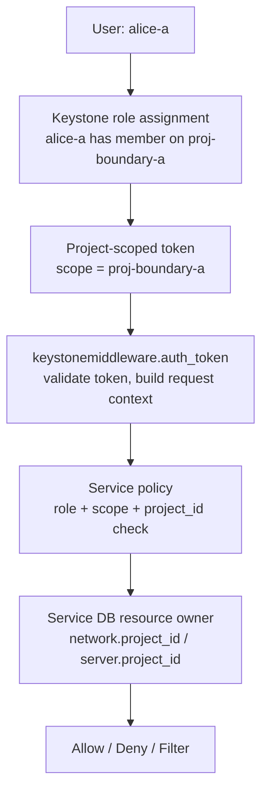

# OpenStack Project 深度原理与边界实验

日期：2026-07-02

## 1. 实验定位

这不是一份“体验 project 功能”的实验，而是一份“拆解 project 边界生成机制”的实验。

你当前环境已确认：

```text
控制/API 节点: csri10 / 172.31.100.10
API VIP:       172.31.100.100
计算节点:      csri8, csri9
admin 凭据:    /etc/kolla/admin-openrc.sh
admin project: admin
service project: service
已有 project:  云评估
```

实验目标：

1. 理解 project 不是一个单独的“隔离开关”，而是多个层次共同形成的租户边界。
2. 找到 project 边界真正发生的位置：Keystone、token、middleware、policy、服务数据库、共享机制、调度和数据平面。
3. 找到 project 的安全缺口：哪里不能靠 project 本身解决，哪里需要后续改装为“更安全可信”的 project。

核心结论会被实验一步步证明：

```text
Project = Keystone 授权 scope
        + OpenStack 服务资源 owner
        + policy 中的 project_id 匹配
        + quota/limit 消费边界
        + 默认可见性边界
        + 可被显式共享机制打开的边界

Project 不是 = 物理主机隔离
Project 不是 = 宿主机可信证明
Project 不是 = 管理员隔离
Project 不是 = 全服务一致的强安全边界
```

## 2. 总体模型

先把 project 的工作链路画出来：



在这条链路里，project 边界不是“某一个地方”：

| 层次 | 边界含义 | 谁负责 |
|---|---|---|
| Keystone 对象层 | project、user、role、assignment 的事实关系 | Keystone |
| Token 层 | 一次请求属于哪个 project scope | Keystone |
| Middleware 层 | 服务是否信任并解析 token | keystonemiddleware |
| Policy 层 | 这个 role/scope 能不能执行这个 API | Nova/Neutron/Cinder/Glance policy |
| 资源 owner 层 | 资源属于哪个 project | 各服务数据库 |
| 可见性/共享层 | 默认隔离是否被 RBAC/public/shared 打开 | 各服务 |
| 调度/物理层 | VM 落在哪台 compute，是否可信 | Nova/Placement/Hypervisor/外部 attestation |

OpenStack 官方文档也对应这个模型：

- Keystone 定义 project 为分组或隔离资源/身份对象的容器。
- Project-scoped token 表达用户在某个租户里的授权。
- OpenStack 服务通过 keystonemiddleware 验证 token。
- 角色的具体含义由服务 policy 解释。
- Nova 默认策略中常见 `project_id:%(project_id)s` 和 `role:member and project_id:%(project_id)s` 这样的规则。

## 3. 实验变量

在 `csri10` 宿主机上执行：

```bash
source /etc/kolla/admin-openrc.sh
```

然后设置变量：

```bash
export DOMAIN=Default

export PROJECT_A=proj-boundary-a
export PROJECT_B=proj-boundary-b

export USER_A=alice-a
export USER_B=bob-b
export USER_PASS='OpenStackProjectLab123!'

if openstack role show member >/dev/null 2>&1; then
  export ROLE_MEMBER=member
else
  export ROLE_MEMBER=_member_
fi

export NET_A=net-boundary-a
export SUBNET_A=subnet-boundary-a
export CIDR_A=10.81.0.0/24

export NET_B=net-boundary-b
export SUBNET_B=subnet-boundary-b
export CIDR_B=10.82.0.0/24

export SERVER_A=server-boundary-a
export SERVER_B=server-boundary-b

export FLAVOR_PRIVATE=flavor-boundary-private

export IMAGE="$(openstack image list -f value -c Name | head -n 1)"
export PUBLIC_FLAVOR="$(openstack flavor list --public -f value -c Name | head -n 1)"
if [ -z "$PUBLIC_FLAVOR" ]; then
  export PUBLIC_FLAVOR="$(openstack flavor list -f value -c Name | head -n 1)"
fi

export OS_AUTH_URL="${OS_AUTH_URL:-$(openstack endpoint list --service identity --interface public -f value -c URL | head -n 1)}"
export NEUTRON_URL="$(openstack endpoint list --service network --interface public -f value -c URL | head -n 1)"
export NOVA_URL="$(openstack endpoint list --service compute --interface public -f value -c URL | head -n 1)"

echo "ROLE_MEMBER=$ROLE_MEMBER"
echo "IMAGE=$IMAGE"
echo "PUBLIC_FLAVOR=$PUBLIC_FLAVOR"
echo "OS_AUTH_URL=$OS_AUTH_URL"
echo "NEUTRON_URL=$NEUTRON_URL"
echo "NOVA_URL=$NOVA_URL"
```

如果 `IMAGE` 或 `PUBLIC_FLAVOR` 为空，先手动设置：

```bash
openstack image list
openstack flavor list

export IMAGE=<镜像名>
export PUBLIC_FLAVOR=<flavor名>
```

## 4. 实验 0：画出你当前环境的控制平面和计算平面

目的：先明确 project 实验发生在哪些服务上。

```bash
openstack project list
openstack user list
openstack role list
openstack endpoint list
openstack compute service list
openstack hypervisor list
```

观察重点：

```text
Keystone: project/user/role/token
Nova API/Scheduler: server API、policy、调度
Neutron Server: network API、policy、project_id、RBAC sharing
MariaDB: Keystone/Nova/Neutron 的资源事实
csri8/csri9: 只是承载 VM 和 Neutron datapath，不负责签发 project token
```

记录：

```bash
openstack compute service list --service nova-compute
```

你应该看到：

```text
nova-compute csri8 enabled up
nova-compute csri9 enabled up
```

原理结论：

```text
Project 边界先发生在控制面 API，不是先发生在 compute 节点。
Compute 节点承载结果，但不决定 user 能不能进入某个 project。
```

### 4.1 如果你已经跑过基础实验

你当前已经至少跑到了 Alice 访问 Project B token 被拒绝，因此 `proj-boundary-a`、`proj-boundary-b`、`alice-a`、`bob-b` 很可能已经存在。不要重复创建也没关系，先刷新 ID 和 token：

```bash
source /etc/kolla/admin-openrc.sh

export PROJECT_A_ID="$(openstack project show "$PROJECT_A" -f value -c id)"
export PROJECT_B_ID="$(openstack project show "$PROJECT_B" -f value -c id)"
export USER_A_ID="$(openstack user show "$USER_A" -f value -c id)"
export USER_B_ID="$(openstack user show "$USER_B" -f value -c id)"

openstack role assignment list --project "$PROJECT_A" --names
openstack role assignment list --project "$PROJECT_B" --names
```

如果 role assignment 已经存在，可以直接从“实验 2：Token 层”继续。  
如果项目或用户不存在，再回到“实验 1”创建。

## 5. 实验 1：Keystone 对象层，project 只是事实对象，不是权限本身

### 5.1 创建两个 project 和两个用户

```bash
openstack project show "$PROJECT_A" >/dev/null 2>&1 || \
  openstack project create "$PROJECT_A" --domain "$DOMAIN"

openstack project show "$PROJECT_B" >/dev/null 2>&1 || \
  openstack project create "$PROJECT_B" --domain "$DOMAIN"

openstack user show "$USER_A" >/dev/null 2>&1 || \
  openstack user create "$USER_A" --domain "$DOMAIN" --password "$USER_PASS"

openstack user show "$USER_B" >/dev/null 2>&1 || \
  openstack user create "$USER_B" --domain "$DOMAIN" --password "$USER_PASS"
```

记录 project ID：

```bash
export PROJECT_A_ID="$(openstack project show "$PROJECT_A" -f value -c id)"
export PROJECT_B_ID="$(openstack project show "$PROJECT_B" -f value -c id)"
export USER_A_ID="$(openstack user show "$USER_A" -f value -c id)"
export USER_B_ID="$(openstack user show "$USER_B" -f value -c id)"

echo "$PROJECT_A -> $PROJECT_A_ID"
echo "$PROJECT_B -> $PROJECT_B_ID"
echo "$USER_A -> $USER_A_ID"
echo "$USER_B -> $USER_B_ID"
```

### 5.2 此时用户还没有 project 权限

```bash
openstack role assignment list --user "$USER_A" --names
openstack role assignment list --user "$USER_B" --names
```

尝试让 Alice 获取 Project A token：

```bash
openstack \
  --os-auth-url "$OS_AUTH_URL" \
  --os-identity-api-version 3 \
  --os-username "$USER_A" \
  --os-password "$USER_PASS" \
  --os-user-domain-name "$DOMAIN" \
  --os-project-name "$PROJECT_A" \
  --os-project-domain-name "$DOMAIN" \
  token issue
```

预期：

```text
失败，通常是 HTTP 401。
```

解释：

```text
Project 对象存在，不代表用户能进入它。
Project 本身不是权限；role assignment 才是权限入口。
```

### 5.3 授予各自 project 上的角色

```bash
openstack role add --project "$PROJECT_A" --user "$USER_A" "$ROLE_MEMBER"
openstack role add --project "$PROJECT_B" --user "$USER_B" "$ROLE_MEMBER"

openstack role assignment list --project "$PROJECT_A" --names
openstack role assignment list --project "$PROJECT_B" --names
```

再获取 token：

```bash
openstack \
  --os-auth-url "$OS_AUTH_URL" \
  --os-identity-api-version 3 \
  --os-username "$USER_A" \
  --os-password "$USER_PASS" \
  --os-user-domain-name "$DOMAIN" \
  --os-project-name "$PROJECT_A" \
  --os-project-domain-name "$DOMAIN" \
  token issue -f yaml
```

预期：

```text
成功，输出包含 project_id。
```

本层结论：

```text
Keystone 对象层只保存事实：
project 是谁，user 是谁，role 是谁，谁在什么 scope 上有 role。

第一个边界点是 role assignment。
```

## 6. 实验 2：Token 层，project 边界进入每一次 API 请求

### 6.1 获取 Alice 和 Bob 的 token

```bash
export TOKEN_A="$(
  openstack \
    --os-auth-url "$OS_AUTH_URL" \
    --os-identity-api-version 3 \
    --os-username "$USER_A" \
    --os-password "$USER_PASS" \
    --os-user-domain-name "$DOMAIN" \
    --os-project-name "$PROJECT_A" \
    --os-project-domain-name "$DOMAIN" \
    token issue -f value -c id
)"

export TOKEN_B="$(
  openstack \
    --os-auth-url "$OS_AUTH_URL" \
    --os-identity-api-version 3 \
    --os-username "$USER_B" \
    --os-password "$USER_PASS" \
    --os-user-domain-name "$DOMAIN" \
    --os-project-name "$PROJECT_B" \
    --os-project-domain-name "$DOMAIN" \
    token issue -f value -c id
)"

echo "TOKEN_A=${TOKEN_A:0:32}..."
echo "TOKEN_B=${TOKEN_B:0:32}..."
```

### 6.2 用 Keystone API 查看 token 元数据

```bash
ADMIN_TOKEN="$(openstack token issue -f value -c id)"

KEYSTONE_V3="${OS_AUTH_URL%/}"
case "$KEYSTONE_V3" in
  */v3) ;;
  *) KEYSTONE_V3="$KEYSTONE_V3/v3" ;;
esac

curl -sS \
  -H "X-Auth-Token: $ADMIN_TOKEN" \
  -H "X-Subject-Token: $TOKEN_A" \
  "$KEYSTONE_V3/auth/tokens" \
  | python3 -m json.tool

curl -sS \
  -H "X-Auth-Token: $ADMIN_TOKEN" \
  -H "X-Subject-Token: $TOKEN_B" \
  "$KEYSTONE_V3/auth/tokens" \
  | python3 -m json.tool
```

观察：

```text
TOKEN_A 的 project_id = PROJECT_A_ID
TOKEN_B 的 project_id = PROJECT_B_ID
```

如果只想打印关键字段：

```bash
curl -sS \
  -H "X-Auth-Token: $ADMIN_TOKEN" \
  -H "X-Subject-Token: $TOKEN_A" \
  "$KEYSTONE_V3/auth/tokens" \
  | python3 -c 'import sys,json; t=json.load(sys.stdin)["token"]; print("user:", t["user"]["name"], t["user"]["id"]); print("project:", t["project"]["name"], t["project"]["id"]); print("roles:", ",".join(r["name"] for r in t["roles"]))'
```

如果你的 Keystone 使用 Fernet token，token 字符串本身是不可直接解码的密文。不要试图从 token 字符串里解析 project；应通过 Keystone 验证接口或 `openstack token show` 看元数据。

### 6.3 Alice 不能拿 Project B token

```bash
openstack \
  --os-auth-url "$OS_AUTH_URL" \
  --os-identity-api-version 3 \
  --os-username "$USER_A" \
  --os-password "$USER_PASS" \
  --os-user-domain-name "$DOMAIN" \
  --os-project-name "$PROJECT_B" \
  --os-project-domain-name "$DOMAIN" \
  token issue
```

预期：

```text
HTTP 401
```

本层结论：

```text
Project 第二个边界点是 project-scoped token。
token 把 user、roles、project scope 带入后续每一次 API 调用。
一个 Project A scoped token 不能变成 Project B scoped token。
```

## 7. 实验 3：API 中间件层，同一个 API 用不同 token 得到不同视图

这一组实验绕过部分 OpenStack CLI 的封装，直接用 token 调 Neutron API，观察服务如何按 token scope 给不同视图。

### 7.1 Alice 和 Bob 分别创建网络

```bash
openstack \
  --os-auth-url "$OS_AUTH_URL" \
  --os-identity-api-version 3 \
  --os-username "$USER_A" \
  --os-password "$USER_PASS" \
  --os-user-domain-name "$DOMAIN" \
  --os-project-name "$PROJECT_A" \
  --os-project-domain-name "$DOMAIN" \
  network create "$NET_A"

openstack \
  --os-auth-url "$OS_AUTH_URL" \
  --os-identity-api-version 3 \
  --os-username "$USER_A" \
  --os-password "$USER_PASS" \
  --os-user-domain-name "$DOMAIN" \
  --os-project-name "$PROJECT_A" \
  --os-project-domain-name "$DOMAIN" \
  subnet create "$SUBNET_A" --network "$NET_A" --subnet-range "$CIDR_A"

openstack \
  --os-auth-url "$OS_AUTH_URL" \
  --os-identity-api-version 3 \
  --os-username "$USER_B" \
  --os-password "$USER_PASS" \
  --os-user-domain-name "$DOMAIN" \
  --os-project-name "$PROJECT_B" \
  --os-project-domain-name "$DOMAIN" \
  network create "$NET_B"

openstack \
  --os-auth-url "$OS_AUTH_URL" \
  --os-identity-api-version 3 \
  --os-username "$USER_B" \
  --os-password "$USER_PASS" \
  --os-user-domain-name "$DOMAIN" \
  --os-project-name "$PROJECT_B" \
  --os-project-domain-name "$DOMAIN" \
  subnet create "$SUBNET_B" --network "$NET_B" --subnet-range "$CIDR_B"
```

### 7.2 直接用 Alice token 调 Neutron

```bash
curl -sS \
  -H "X-Auth-Token: $TOKEN_A" \
  "$NEUTRON_URL/v2.0/networks" \
  | python3 -m json.tool
```

### 7.3 直接用 Bob token 调同一个 Neutron URL

```bash
curl -sS \
  -H "X-Auth-Token: $TOKEN_B" \
  "$NEUTRON_URL/v2.0/networks" \
  | python3 -m json.tool
```

观察：

```text
同一个 URL: /v2.0/networks
不同 token: TOKEN_A vs TOKEN_B
不同结果: Alice 默认看到 NET_A，Bob 默认看到 NET_B
```

你当前环境中还会看到 `public1` 同时出现在 Alice 和 Bob 的返回里：

```text
name = public1
project_id = admin project
router:external = true
shared = false
```

这不是实验失败，而是 Neutron 外部网络可见性/policy 的结果。它说明 project 默认隔离有服务级例外：外部网络、public/shared/RBAC shared 资源可能对多个 project 可见，即使 owner project 仍然是 admin 或其他 project。

如果多次执行 `network create "$NET_A"` 或 `network create "$NET_B"`，可能会看到同名网络重复出现。后续实验建议选带有 subnet 的那个网络作为主观察对象。

如果你的环境没有 `python3`，可以先不用格式化：

```bash
curl -sS -H "X-Auth-Token: $TOKEN_A" "$NEUTRON_URL/v2.0/networks"
```

本层结论：

```text
Project 第三个边界点在服务认证中间件和请求上下文。
Neutron 接收的不是“用户口头说自己是谁”，而是 Keystone 签发的 scoped token。
keystonemiddleware 验证 token 后，把 project_id、user_id、roles 放进请求上下文。
```

## 8. 实验 4：资源 owner 层，project_id 是服务资源的归属事实

### 8.1 查看网络的 project_id

```bash
openstack network show "$NET_A" -c id -c name -c project_id -c shared -f yaml
openstack network show "$NET_B" -c id -c name -c project_id -c shared -f yaml
```

预期：

```text
NET_A.project_id = PROJECT_A_ID
NET_B.project_id = PROJECT_B_ID
shared = False
```

### 8.2 Bob 用自己的 token 直接访问 NET_A

```bash
export NET_A_ID="$(openstack network show "$NET_A" -f value -c id)"

openstack \
  --os-auth-url "$OS_AUTH_URL" \
  --os-identity-api-version 3 \
  --os-username "$USER_B" \
  --os-password "$USER_PASS" \
  --os-user-domain-name "$DOMAIN" \
  --os-project-name "$PROJECT_B" \
  --os-project-domain-name "$DOMAIN" \
  network show "$NET_A_ID"
```

预期：

```text
失败，表现为 Not Found 或 Forbidden。
```

为什么有时是 Not Found，而不是 Forbidden？

```text
很多 OpenStack 服务会对非 owner project 隐藏资源存在性。
这本身也是边界的一部分：既不让你操作，也不一定告诉你资源存在。
```

本层结论：

```text
Project 第四个边界点是服务资源里的 project_id。
Keystone 只签 token，不保存 Neutron network 或 Nova server。
Neutron/Nova 自己的数据库记录 resource.project_id，然后用 policy 判断当前 token.project_id 能否访问它。
```

## 9. 实验 5：Policy 层，project_id 匹配不是自然法则，是服务策略

这一组只做读取和行为验证，不修改生产 policy。

### 9.1 查看 Nova policy 的默认思想

在 `csri10` 上查看 Nova policy 文件位置：

```bash
docker exec nova_api bash -lc 'ls -l /etc/nova/policy.yaml /etc/nova/policy.d 2>/dev/null || true'
```

如果存在 policy 文件，搜索关键规则：

```bash
docker exec nova_api bash -lc "grep -R \"project_id:%(project_id)s\\|project_member\\|admin_or_owner\\|context_is_admin\" /etc/nova/policy.yaml /etc/nova/policy.d 2>/dev/null || true"
```

即使没有本地 policy override，Nova 也有代码内置默认 policy。Nova 官方 policy 文档中能看到类似：

```text
admin_or_owner = is_admin:True or project_id:%(project_id)s
project_member_api = role:member and project_id:%(project_id)s
project_reader_api = role:reader and project_id:%(project_id)s
```

### 9.2 创建 Project A 的 VM

```bash
openstack \
  --os-auth-url "$OS_AUTH_URL" \
  --os-identity-api-version 3 \
  --os-username "$USER_A" \
  --os-password "$USER_PASS" \
  --os-user-domain-name "$DOMAIN" \
  --os-project-name "$PROJECT_A" \
  --os-project-domain-name "$DOMAIN" \
  server create "$SERVER_A" \
  --image "$IMAGE" \
  --flavor "$PUBLIC_FLAVOR" \
  --network "$NET_A"
```

等待：

```bash
openstack server list --project "$PROJECT_A"
```

查看。注意：server 是 Alice 在 Project A 中创建的，切回 admin 后用名字查找可能只在 admin 当前 project 中解析名字，导致 `No Server found for server-policy-a`。更稳的方法是先用 `--all-projects` 找到 server ID，再用 ID 查看。

```bash
source /etc/kolla/admin-openrc.sh

openstack server list --all-projects --long --name "$SERVER_A"

export SERVER_A_ID="$(openstack server list --all-projects --name "$SERVER_A" -f value -c ID | head -n 1)"
echo "$SERVER_A_ID"

openstack server show "$SERVER_A_ID" \
  -c id \
  -c name \
  -c status \
  -c project_id \
  -c user_id \
  -c OS-EXT-SRV-ATTR:host \
  -f yaml
```

### 9.3 Bob 尝试访问 Alice 的 VM

```bash
openstack \
  --os-auth-url "$OS_AUTH_URL" \
  --os-identity-api-version 3 \
  --os-username "$USER_B" \
  --os-password "$USER_PASS" \
  --os-user-domain-name "$DOMAIN" \
  --os-project-name "$PROJECT_B" \
  --os-project-domain-name "$DOMAIN" \
  server show "$SERVER_A_ID"
```

预期：

```text
失败，通常是 Not Found 或 Forbidden。
```

### 9.4 Admin 可以跨 project 看到它

```bash
source /etc/kolla/admin-openrc.sh

openstack server show "$SERVER_A_ID" \
  -c id \
  -c name \
  -c project_id \
  -c OS-EXT-SRV-ATTR:host \
  -f yaml

openstack server list --all-projects
```

本层结论：

```text
Project 第五个边界点是服务 policy。
普通用户的 project 边界通常依赖 policy 中的 project_id 匹配。
Admin 能跨 project，是因为 policy 允许 admin/system/operator 角色绕过普通 owner 匹配。
所以 project 不是管理员隔离边界。
```

## 10. 实验 6：数据库层，project_id 是跨服务事实锚点

这一组是只读观察。不要对数据库执行 UPDATE/DELETE。

### 10.1 获取 MariaDB root 密码

```bash
export DB_PASS="$(awk '/^database_password:/ {print $2}' /etc/kolla/passwords.yml)"
echo "DB_PASS length: ${#DB_PASS}"
```

如果为空：

```bash
grep -n 'database_password' /etc/kolla/passwords.yml
```

不要把密码贴出来。

### 10.2 Keystone 数据库中查看 project

```bash
docker exec mariadb mysql -uroot -p"$DB_PASS" -e "
USE keystone;
SELECT id, name, domain_id, enabled
FROM project
WHERE name IN ('$PROJECT_A', '$PROJECT_B');
"
```

### 10.3 Neutron 数据库中查看 network owner

```bash
docker exec mariadb mysql -uroot -p"$DB_PASS" -e "
USE neutron;
SELECT id, name, project_id
FROM networks
WHERE name IN ('$NET_A', '$NET_B');
"
```

### 10.4 Nova cell 数据库中查看 instance owner

先看 Nova 数据库：

```bash
docker exec mariadb mysql -uroot -p"$DB_PASS" -e "SHOW DATABASES LIKE 'nova%';"
```

依次尝试：

```bash
docker exec mariadb mysql -uroot -p"$DB_PASS" -e "
USE nova_cell0;
SELECT uuid, display_name, project_id, user_id, vm_state, host
FROM instances
WHERE display_name LIKE 'server-boundary%';
"
```

如果没有结果，再查其他 cell，例如：

```bash
docker exec mariadb mysql -uroot -p"$DB_PASS" -e "
USE nova_cell1;
SELECT uuid, display_name, project_id, user_id, vm_state, host
FROM instances
WHERE display_name LIKE 'server-boundary%';
"
```

本层结论：

```text
Project 第六个边界点是各服务数据库里的 project_id。
Keystone 的 project_id 被服务复制进自己的资源表，成为后续 API 过滤、policy target 和 quota 计算的事实依据。
```

## 11. 实验 7：共享机制，project 边界可以被服务显式打开

### 11.1 把 NET_A 共享给 Project B

```bash
openstack network rbac create \
  --target-project "$PROJECT_B_ID" \
  --action access_as_shared \
  --type network \
  "$NET_A_ID"

openstack network rbac list --long
```

### 11.2 Bob 再看网络

```bash
openstack \
  --os-auth-url "$OS_AUTH_URL" \
  --os-identity-api-version 3 \
  --os-username "$USER_B" \
  --os-password "$USER_PASS" \
  --os-user-domain-name "$DOMAIN" \
  --os-project-name "$PROJECT_B" \
  --os-project-domain-name "$DOMAIN" \
  network list

openstack \
  --os-auth-url "$OS_AUTH_URL" \
  --os-identity-api-version 3 \
  --os-username "$USER_B" \
  --os-password "$USER_PASS" \
  --os-user-domain-name "$DOMAIN" \
  --os-project-name "$PROJECT_B" \
  --os-project-domain-name "$DOMAIN" \
  network show "$NET_A_ID" \
  -c id \
  -c name \
  -c project_id \
  -c shared \
  -f yaml
```

观察：

```text
Bob 现在能看到 NET_A。
NET_A.project_id 仍然是 Project A。
共享打开的是使用/可见性，不是 owner 转移。
```

本层结论：

```text
Project 第七个边界点是服务共享模型。
默认隔离可以被 RBAC/public/shared 等机制打开。
因此“project 边界在哪里”必须问：哪个服务，哪种资源，是否允许 sharing。
```

## 12. 实验 8：Private flavor，project 可以控制资源入口，但不是完整安全

### 12.1 创建只给 Project A 使用的 private flavor

```bash
openstack flavor create "$FLAVOR_PRIVATE" \
  --private \
  --ram 512 \
  --disk 1 \
  --vcpus 1

openstack flavor set --project "$PROJECT_A" "$FLAVOR_PRIVATE"
```

### 12.2 Alice 能看到，Bob 看不到

```bash
openstack \
  --os-auth-url "$OS_AUTH_URL" \
  --os-identity-api-version 3 \
  --os-username "$USER_A" \
  --os-password "$USER_PASS" \
  --os-user-domain-name "$DOMAIN" \
  --os-project-name "$PROJECT_A" \
  --os-project-domain-name "$DOMAIN" \
  flavor list

openstack \
  --os-auth-url "$OS_AUTH_URL" \
  --os-identity-api-version 3 \
  --os-username "$USER_B" \
  --os-password "$USER_PASS" \
  --os-user-domain-name "$DOMAIN" \
  --os-project-name "$PROJECT_B" \
  --os-project-domain-name "$DOMAIN" \
  flavor list
```

本层结论：

```text
Private flavor 说明 project 可以控制“谁能请求某类资源入口”。
但 flavor access 本身不证明宿主机可信。
要把它升级成可信 project，需要结合 Placement traits、host aggregates、Keylime attestation 等机制。
```

## 13. 实验 9：调度/物理层，project 不是物理隔离边界

### 13.1 创建 Project B 的 VM

```bash
openstack \
  --os-auth-url "$OS_AUTH_URL" \
  --os-identity-api-version 3 \
  --os-username "$USER_B" \
  --os-password "$USER_PASS" \
  --os-user-domain-name "$DOMAIN" \
  --os-project-name "$PROJECT_B" \
  --os-project-domain-name "$DOMAIN" \
  server create "$SERVER_B" \
  --image "$IMAGE" \
  --flavor "$PUBLIC_FLAVOR" \
  --network "$NET_B"
```

查看两个 VM 的宿主机：

```bash
source /etc/kolla/admin-openrc.sh

openstack server show "$SERVER_A" \
  -c name \
  -c project_id \
  -c OS-EXT-SRV-ATTR:host \
  -f yaml

openstack server show "$SERVER_B" \
  -c name \
  -c project_id \
  -c OS-EXT-SRV-ATTR:host \
  -f yaml
```

观察：

```text
Project A 和 Project B 的 VM 可能落在同一台 compute，也可能落在不同 compute。
这取决于 Nova 调度，不取决于 project 本身。
```

如果你想强行证明“project 默认不等于物理隔离”，可以多创建几台小 VM，观察它们是否混布在 csri8/csri9：

```bash
openstack server list --all-projects --long \
  | egrep 'server-boundary|Name|Host'
```

本层结论：

```text
Project 是 API/资源/授权边界，不是物理主机边界。
要实现“可信 project 只能落在可信主机”，必须改造 Nova/Placement 调度约束，而不是只改 Keystone project。
```

## 14. 实验 10：Quota，project 是资源消费边界

记录当前 quota：

```bash
openstack quota show "$PROJECT_A" -f yaml
```

设置 Project A quota：

```bash
openstack quota set \
  --instances 1 \
  --cores 2 \
  --ram 2048 \
  "$PROJECT_A"
```

Alice 再创建第二台 VM：

```bash
openstack \
  --os-auth-url "$OS_AUTH_URL" \
  --os-identity-api-version 3 \
  --os-username "$USER_A" \
  --os-password "$USER_PASS" \
  --os-user-domain-name "$DOMAIN" \
  --os-project-name "$PROJECT_A" \
  --os-project-domain-name "$DOMAIN" \
  server create server-boundary-a-second \
  --image "$IMAGE" \
  --flavor "$PUBLIC_FLAVOR" \
  --network "$NET_A"
```

预期：

```text
如果 Project A 已有一台 VM，第二台因为 quota 不足失败。
Project B 不受 Project A quota 影响。
```

本层结论：

```text
Project 还是资源消费和计费/限制维度。
Quota 不是 Keystone 独自执行，而是 Nova/Cinder/Neutron 等服务根据 project usage 执行。
```

## 15. 从实验反推：如果要把 project 改装得更安全可信，该改哪里

通过上面实验，后续改装方向应该分层设计。

### 15.1 Keystone 层能改什么

适合做：

- 定义可信 project 的元数据或 tag。
- 定义可信 project 专用 role，例如 `trusted_member`。
- 限制哪些用户能进入可信 project。
- 加强 application credential、MFA、token 过期时间等认证策略。

不适合只靠 Keystone 做：

- 判断 compute 是否可信。
- 控制 VM 实际落在哪台主机。
- 证明 guest OS 完整性。

### 15.2 Policy 层能改什么

适合做：

- 让某些高风险 API 只允许 trusted role。
- 限制可信 project 内用户创建不合规资源。
- 对 image、volume、network、secret 等 API 增加强约束。

风险：

- 各服务 policy 不完全一致。
- 一条宽松 policy 可能绕过你以为的边界。
- 修改全局 policy 会影响所有 project，要先在测试环境验证。

### 15.3 Nova/Placement 层能改什么

适合做：

- 为可信 compute 打 Placement trait，例如 `CUSTOM_KEYLIME_ATTESTED`。
- 为可信 flavor 设置 `trait:CUSTOM_KEYLIME_ATTESTED=required`。
- 用 private flavor 只授权给 trusted project。
- 用 host aggregate/availability zone 做更粗粒度隔离。

这是把 project 升级为“可信 project”的关键层。

### 15.4 Neutron 层能改什么

适合做：

- 禁止可信 project 使用不可信 shared network。
- 控制 RBAC sharing。
- 限制 provider network、external network、router、floating IP。
- 强制安全组基线。

### 15.5 Glance/Cinder/Barbican 层能改什么

适合做：

- 只允许可信 project 使用可信镜像。
- 只允许可信 project 使用加密 volume type。
- 将密钥释放绑定到 attestation 结果。
- 后续和 Keylime/Barbican 结合做密钥释放。

### 15.6 Keylime/Attestation 层能改什么

适合做：

- 判断 compute 节点当前是否可信。
- 将 PASS/FAIL 同步到 Placement trait。
- FAIL 时移除可信 trait 或禁用 compute。
- 后续让可信 project 的 workload 只能调度到 Keylime PASS 节点。

## 16. 最终边界地图

| 问题 | 实验观察 | 真正边界位置 |
|---|---|---|
| 用户能不能进入 project | Alice 不能拿 Project B token | Keystone role assignment + token scope |
| API 怎么知道请求属于哪个 project | 同一 Neutron URL 用不同 token 结果不同 | keystonemiddleware request context |
| 为什么 Bob 看不到 Alice 的 network | NET_A.project_id 是 Project A | Neutron policy + network.project_id |
| 为什么 admin 能看到所有 project | admin token 可 `--all-projects` | 服务 policy 允许 operator/admin |
| 为什么共享后 Bob 能看到 NET_A | Neutron RBAC policy 生效 | 服务共享模型打开边界 |
| 为什么 private flavor 只有 A 可用 | flavor access list 包含 Project A | Nova flavor access |
| 为什么两个 project 可能同宿主机 | VM 调度到 csri8/csri9 | Project 不控制物理主机 |
| 如何做可信 project | private flavor + Placement trait + Keylime | Nova/Placement/attestation 改造 |

## 17. 清理

清理前先确认测试资源：

```bash
source /etc/kolla/admin-openrc.sh

openstack server list --all-projects | egrep 'server-boundary|ID' || true
openstack network list | egrep 'net-boundary|ID' || true
openstack flavor list --all | egrep 'flavor-boundary|ID' || true
openstack network rbac list --long
```

删除 VM：

```bash
openstack server delete "$SERVER_A" || true
openstack server delete "$SERVER_B" || true
openstack server delete server-boundary-a-second || true
```

删除 RBAC：

```bash
openstack network rbac list --long
```

找到与 `NET_A_ID` 相关的 RBAC ID 后：

```bash
openstack network rbac delete <RBAC_ID>
```

删除网络：

```bash
openstack subnet delete "$SUBNET_A" || true
openstack subnet delete "$SUBNET_B" || true
openstack network delete "$NET_A" || true
openstack network delete "$NET_B" || true
```

删除 flavor：

```bash
openstack flavor delete "$FLAVOR_PRIVATE" || true
```

删除用户和 project：

```bash
openstack role remove --project "$PROJECT_A" --user "$USER_A" "$ROLE_MEMBER" || true
openstack role remove --project "$PROJECT_B" --user "$USER_B" "$ROLE_MEMBER" || true

openstack user delete "$USER_A" || true
openstack user delete "$USER_B" || true

openstack project delete "$PROJECT_A" || true
openstack project delete "$PROJECT_B" || true
```

## 18. 实验记录模板

```markdown
## Project 深度实验记录

### 环境

- 控制节点：csri10 / 172.31.100.10
- API VIP：172.31.100.100
- 计算节点：csri8, csri9
- OpenStack 版本：
- admin project id：
- Project A id：
- Project B id：

### 分层观察

| 层 | 现象 | 结论 |
|---|---|---|
| Keystone assignment | Alice 只能拿 A token | role assignment 是第一边界 |
| Token scope | token show 里 project_id 不同 | token 把 project 带入 API 请求 |
| Middleware/API | 同一 URL 不同 token 结果不同 | 服务按 token 上下文过滤 |
| Policy | Bob show A server 失败，admin 成功 | project 边界由 policy 执行，admin 可跨越 |
| DB owner | network/server 记录 project_id | project_id 是服务资源 owner |
| Sharing | RBAC 后 Bob 能看到 NET_A | 边界可显式打开 |
| Scheduling | A/B VM 可能同宿主机 | project 不是物理可信边界 |

### 最终理解

Project 的真正边界是多层叠加结果，不是 Keystone 单点能力。若要做安全可信 project，必须把 Keystone 身份边界、服务 policy、资源可见性、Nova/Placement 调度约束和 Keylime attestation 结果联动起来。
```

## 19. 参考资料

- Keystone Identity Concepts: https://docs.openstack.org/keystone/latest/admin/identity-concepts.html
- Keystone Tokens: https://docs.openstack.org/keystone/latest/admin/tokens-overview.html
- keystonemiddleware Architecture: https://docs.openstack.org/keystonemiddleware/latest/middlewarearchitecture.html
- Nova Policies: https://docs.openstack.org/nova/latest/configuration/policy.html
- Nova Flavors: https://docs.openstack.org/nova/latest/user/flavors.html
- Nova Quotas: https://docs.openstack.org/nova/latest/admin/quotas.html
- Neutron RBAC: https://docs.openstack.org/neutron/latest/admin/config-rbac.html

