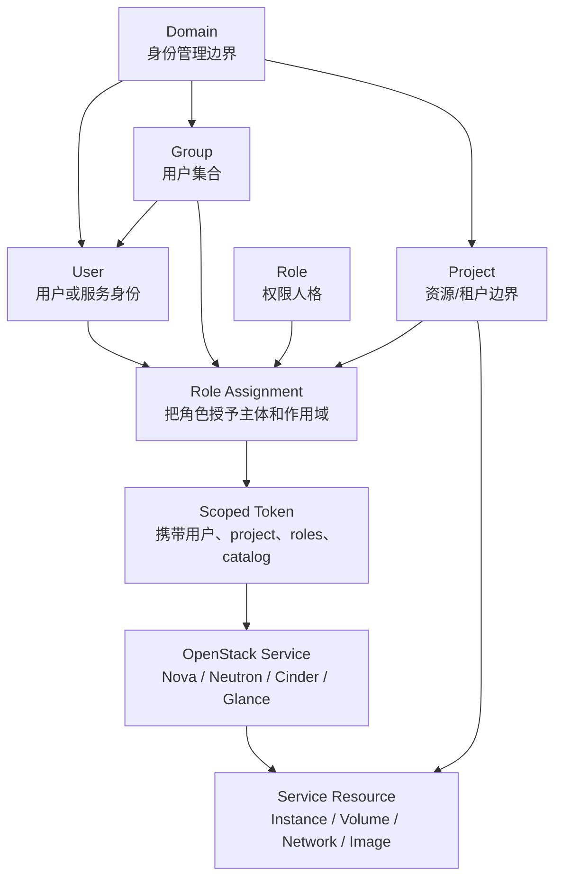
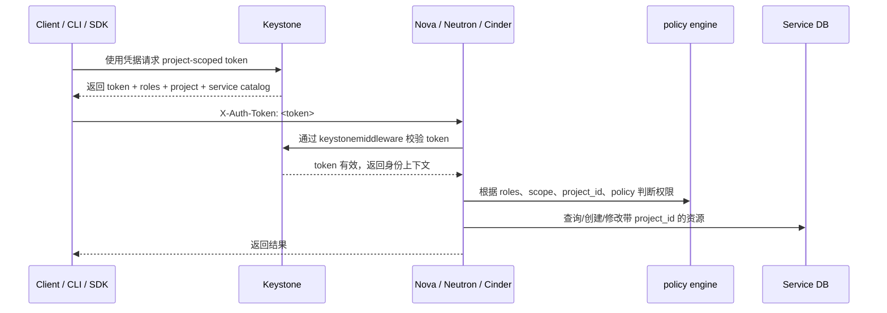
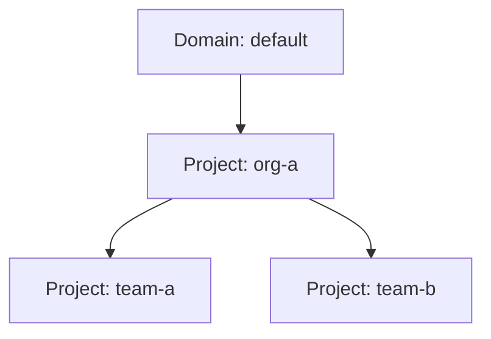

# OpenStack Project 原理详解

日期：2026-07-02

本文只解释 OpenStack 中 `project` 的设计原理、授权链路、资源归属和边界，不包含实验步骤。

## 1. 一句话定义

在 OpenStack 里，`project` 是 Keystone 里的一个身份与资源隔离容器。它通常对应一个租户、客户、部门、业务系统、团队或账号空间。

OpenStack 官方对 project 的定义是：project 是一个用于分组或隔离资源或身份对象的容器；根据云运营者的设计，它可以映射为 customer、account、organization 或 tenant。

需要特别区分两个容易混淆的含义：

- `OpenStack project`：也可能指 Nova、Neutron、Cinder、Glance、Keystone 这样的 OpenStack 组件项目。
- `Keystone project`：本文讨论的 project，指云里的租户/资源隔离单元。

旧版 OpenStack 和很多历史资料会使用 `tenant` 一词。Identity API v3 之后，`tenant` 基本被 `project` 取代。很多服务数据库、API 字段或日志里仍可能看到 `tenant_id`，实际语义通常就是 `project_id`。

## 2. Project 在 Keystone 模型中的位置

Keystone 的核心对象可以简化成下面这张图：



几个关键点：

- `Domain` 是更高层的身份管理边界，包含 projects、users、groups。
- `Project` 是资源消费和授权作用域，最终用户大多数云资源操作都发生在某个 project scope 里。
- `User` 不是天然“属于”某个 project；用户通过 role assignment 在某个 project 上获得角色。
- `Group` 是用户集合，对 group 授予 project 角色后，组内用户继承该 project 权限。
- `Role` 本身只是名字和语义载体，具体能做什么由各服务的 `policy.yaml` 或默认策略解释。

## 3. Project 的数据属性

从 Identity API v3 看，一个 project 通常包含这些重要属性：

| 属性 | 含义 |
|---|---|
| `id` | Project 的全局唯一 ID，通常是 UUID。服务资源一般记录这个 ID。 |
| `name` | Project 名称。名称只要求在 owning domain 内唯一。 |
| `domain_id` | Project 所属 domain。 |
| `enabled` | Project 是否启用。禁用后会影响该 project 的认证/授权使用。 |
| `description` | 描述信息。 |
| `parent_id` | 父 project ID，用于 project hierarchy。创建后不可变。 |
| `is_domain` | 是否让该 project 同时表现为 domain。普通 project 通常为 `false`。 |
| `tags` | Project 标签，可用于分类、筛选、运营管理。 |
| `options` | Project 的资源选项，例如 `immutable`。 |

这带来几个实践上的判断：

- 代码和策略里应优先使用 `project_id`，不要依赖 project name。
- 同名 project 可以存在于不同 domain 中。
- 如果存在 project hierarchy，`parent_id` 会影响继承授权和部分 limit 模型，但不是所有 OpenStack 服务都会以同样方式理解层级。

## 4. Project、Domain、User、Group 的关系

### 4.1 Domain 是身份命名空间

Domain 是 Keystone API v3 的身份管理边界。一个 domain 可以包含 users、groups 和 projects。

它解决的是“身份对象怎么分区管理”的问题。例如：

- 一个公有云运营商可以给不同大客户不同 domain。
- 一个企业私有云可以按组织、事业部或外部身份源划分 domain。
- Domain admin 可以管理该 domain 内的 users、groups、projects 和 role assignments，具体能力取决于策略。

### 4.2 Project 是资源与授权作用域

Project 解决的是“资源算谁的、请求在哪个租户空间里执行”的问题。

例如：

- Nova instance 属于某个 project。
- Cinder volume 属于某个 project。
- Neutron network/port/router/security group 属于某个 project，或通过 RBAC 被共享给其他 project。
- Glance image 可以是 private、shared、community、public 等可见性模型，访问边界和 project 相关。

### 4.3 User 通过角色进入 project

User 本身只是身份。用户要在 project 内消费资源，必须拿到该 project 上的 role assignment。

同一个 user 可以：

- 在 `project-a` 是 `member`。
- 在 `project-b` 是 `reader`。
- 在 `project-c` 是 `admin`。
- 在 system scope 或 domain scope 上另有角色。

这也是理解 project 的核心：权限不是“用户全局拥有”，而是“用户在某个 scope 上拥有某些 roles”。

### 4.4 Group 是批量授权工具

Group 属于 domain，是用户集合。对 group 授予 project role 后，组内用户获取该 project-scoped token 时会获得相应角色。

这适合表达：

- 团队成员都能使用某个 project。
- 运维组在多个 project 上拥有 reader。
- 某个业务组在自己的 project 上拥有 member。

## 5. Role Assignment：Project 权限的真正入口

Project 权限的核心不是 project 对象本身，而是 role assignment。

一个 role assignment 可以抽象为：

```text
subject + role + scope
```

其中：

- `subject`：user 或 group。
- `role`：`admin`、`manager`、`member`、`reader`、`service` 或自定义角色。
- `scope`：project、domain 或 system。

Project 作用域的授权可以表达为：

```text
user alice has role member on project demo
group dev-team has role reader on project prod
```

这不是简单的 ACL 表。Keystone 只负责记录 assignment 并把相关角色放入 token；真正能执行哪些 API，由目标服务的 policy 决定。

## 6. 默认角色层级

现代 Keystone 默认提供几个标准角色：

- `reader`
- `member`
- `manager`
- `admin`
- `service`

其中 `admin`、`manager`、`member`、`reader` 存在 role implication：

```text
admin -> manager -> member -> reader
```

含义是：

- 拥有 `admin` 通常隐含 `manager`、`member`、`reader`。
- 拥有 `manager` 通常隐含 `member`、`reader`。
- 拥有 `member` 通常隐含 `reader`。
- `service` 是独立角色，主要用于服务到服务调用，不在上述层级中。

常见语义：

| 角色 | 常见语义 |
|---|---|
| `reader` | 查看当前 scope 内资源，原则上只读。 |
| `member` | 普通资源消费者，通常能创建资源。 |
| `manager` | 偏身份/管理用途，常用于 domain 内委派管理。 |
| `admin` | 当前 scope 内的高权限角色。 |
| `service` | OpenStack 服务之间通信使用。 |

要注意：`admin on project`、`admin on domain`、`admin on system` 不是同一回事。项目管理员不应该天然拥有跨 project 或全局系统管理能力；不过不同服务对新 RBAC 模型的采用程度可能不同，实际行为要看服务版本和 policy。

## 7. Token Scope：Project 权限如何进入一次 API 请求

用户访问 OpenStack 服务时，不是每次都把用户名密码交给 Nova、Neutron 或 Cinder。典型链路是：



Token scope 决定一次请求“在哪个授权上下文里”执行。

| Token 类型 | 作用 |
|---|---|
| `unscoped token` | 只证明身份，不包含 project/domain/system 授权 scope、roles 或 service catalog。通常用于换取 scoped token。 |
| `project-scoped token` | 表示用户在某个 project 内的授权。多数最终用户资源操作使用这种 token。 |
| `domain-scoped token` | 表示用户在某个 domain 内的授权。常用于管理 domain 内 users、groups、projects。 |
| `system-scoped token` | 表示用户在整个部署系统上的授权。常用于云管理员或 operator 操作。 |

Project-scoped token 的重要性质：

- 一个 project-scoped token 只作用于一个 project。
- 不能把 `project-a` 的 scoped token 拿去当作 `project-b` 的授权。
- Token 中包含 user、project、roles 和 service catalog。
- 服务 API 通过 token 中的 project 信息和服务自身资源的 `project_id` 做授权判断。

## 8. 服务如何执行 Project 边界

Keystone 不直接管理 Nova instance、Cinder volume、Neutron port。它提供身份、token、role assignment 和 catalog。真正的资源访问边界由各服务执行。

服务侧通常有三层判断：

### 8.1 认证层

OpenStack 服务通常通过 `keystonemiddleware.auth_token` 校验请求中的 token。该中间件会：

- 从 HTTP header 中取 token。
- 向 Keystone 校验 token。
- 将用户、project、roles、catalog 等信息放入请求上下文。
- token 无效时拒绝请求，或按配置把决策交给后端服务。

### 8.2 Policy 层

服务拿到身份上下文后，通过 policy 判断 API 是否允许执行。

常见判断条件包括：

- 用户有哪些 roles。
- token 是 project scope、domain scope 还是 system scope。
- 请求目标资源的 `project_id` 是否等于 token 的 project ID。
- 是否是 service token。
- 是否满足服务自定义规则。

典型策略思想可以表达为：

```text
allow if role:admin
allow if project_id:%(project_id)s
allow if role:member and project_id:%(project_id)s
allow if system_scope:all and role:reader
```

这也解释了一个常见现象：两个服务对同一个角色名的解释可能不同。角色的“名字”存在 Keystone，角色的“具体权限”存在服务 policy。

### 8.3 数据层

服务资源通常会记录 `project_id` 或历史字段 `tenant_id`。

例如：

```text
server.project_id
volume.project_id
network.project_id
port.project_id
security_group.project_id
image.owner / visibility / member
```

服务在 list/show/update/delete 时，会结合 token 里的 project scope 和资源上的 project ownership 过滤或拒绝访问。

## 9. Project 是什么边界

Project 通常承担四类边界。

### 9.1 授权边界

Project 控制“谁能在这个租户空间里执行操作”。

用户必须在 project 上拥有角色，才能拿到 project-scoped token 并执行该 project 内的资源操作。

### 9.2 资源归属边界

资源创建后通常归属到当前 token scope 对应的 project。

这意味着：

- 创建 VM 时，VM 归属当前 project。
- 创建 volume 时，volume 归属当前 project。
- 创建 private network 时，network 归属当前 project。
- 查询资源时，普通用户默认只看到当前 project 可见的资源。

### 9.3 配额/limit 边界

Project 是配额和资源 limit 的主要维度。

传统服务配额和 Keystone Unified Limits 都围绕 project 建模。例如 Nova 文档说明，quota 可以在 project 和 project-user 级别执行；Keystone Unified Limits 则把 registered limits、domain limits、project limits 作为跨服务 limit 管理模型。

注意这里有两个系统：

- Keystone 可以保存 limit 信息。
- 各服务负责统计 usage 并在资源申请时执行 enforcement。

也就是说，project limit 是控制资源消费的边界，但使用量计算仍依赖具体服务。

### 9.4 可见性边界

很多资源默认只在 owning project 内可见，或通过显式共享扩展给其他 project。

典型例子：

- Nova public flavor 对所有 project 可见；private flavor 只对 access list 中的 project 可见。
- Neutron RBAC 可以把 network、QoS policy、security group、address scope、subnet pool 等对象共享给指定 project。
- Glance image 有自己的 image visibility 和 image member 模型。

这说明 project 边界不是永远封死的墙，而是默认隔离、显式共享。

## 10. Project 不是什么边界

Project 很重要，但它不是万能隔离机制。

### 10.1 不是物理隔离边界

两个 project 的 VM 可能运行在同一台 compute host 上。Project 本身不会自动保证：

- 不同 project 使用不同物理机。
- 不同 project 使用不同 NUMA 节点。
- 不同 project 使用不同存储后端。
- 不同 project 使用不同网络硬件。

这些需要通过 Nova scheduling、host aggregate、availability zone、Placement traits、flavor extra specs、Neutron provider network、存储 type 等机制实现。

### 10.2 不是强安全边界的全部

Project 是 API/RBAC/资源归属边界，不等价于完整安全边界。

真正的多租户安全还依赖：

- Hypervisor 隔离。
- Neutron 网络隔离。
- Cinder 后端隔离和 volume 清理。
- Glance 镜像访问控制。
- Barbican secret 访问控制。
- Policy 配置。
- 服务账号权限控制。
- 日志、审计和运维流程。

### 10.3 不能限制 system admin

拥有 system scope 管理权限的 operator 通常可以跨 project 查看或管理资源，具体能力取决于服务 policy。

因此 project 主要隔离普通用户、项目管理员和业务租户，不隔离云平台管理员。

### 10.4 不能替代服务 policy

Project 只提供 scope。真正决定某个 API 能不能执行的是服务 policy。

如果某个服务 policy 写得过宽，或者仍采用旧式 `admin_or_owner` 逻辑，project 边界的实际效果就会受影响。

### 10.5 不能自动处理共享资源风险

一旦资源被共享，其他 project 可能获得可见性或使用权。

例如 Neutron RBAC 共享 network 后，目标 project 可以看到网络并创建端口。删除共享策略时，如果目标 project 已经在该网络上创建了依赖资源，服务可能会阻止删除 RBAC policy，直到依赖资源被清理。

## 11. Project Hierarchy

Keystone 支持 project hierarchy。Project 可以有 `parent_id`，从而构成树形结构。



Project hierarchy 的主要用途：

- 表达组织结构。
- 支持继承 role assignment。
- 支持某些 limit enforcement model。
- 帮助运营侧按组织树管理资源。

重要限制：

- `parent_id` 创建后不可变，project 不能随意移动到另一棵树。
- 角色继承需要显式使用 inherited assignment，不是有父子关系就自动继承所有角色。
- 服务对 project hierarchy 的支持程度不完全一致。
- 旧服务或旧 policy 可能只理解扁平 project。

Keystone 的 OS-INHERIT API 支持两类继承思想：

- 在 domain 上授予 inherited role，使其应用于该 domain 下的 projects。
- 在某个 project 上授予 inherited role，使其应用于该 project 的 subtree projects，但不应用于 anchor project 本身。

## 12. Project 与 Quota / Unified Limits

Project 是 OpenStack 资源限额的核心维度。

传统配额通常由各服务自己保存和执行，例如：

- Nova 管 instances、cores、ram 等。
- Cinder 管 volumes、gigabytes、snapshots 等。
- Neutron 管 networks、ports、routers、security groups 等。

Keystone Unified Limits 试图把 limit 信息统一存储在 Keystone 中，再由服务消费这些 limit 并结合自身 usage 执行限制。

可以把它理解为：

```text
Keystone: 维护 limit 定义和 project/domain limit
Service: 统计 usage，并在创建/扩容资源时执行 enforcement
```

Project limit 的几个关键点：

- Default registered limit 可以作为所有 project 的默认值。
- Project-specific limit 可以覆盖默认值。
- Domain limit 可能影响 domain 下 project，取决于 enforcement model。
- 有 project hierarchy 时，limit enforcement model 会决定父子 project 的资源是否共享、是否独立、如何计算。

这解释了一个常见疑问：为什么 Keystone 里设置了 project limit，但某个服务的行为仍取决于服务配置？因为 limit 信息和 usage enforcement 分属两个层次。

## 13. Project 与共享资源

OpenStack 的 project 不是绝对封闭空间。很多资源支持“私有、公共、共享”这样的可见性模型。

### 13.1 Nova Flavor

Nova flavor 默认是 public，对所有 project 可见。Private flavor 只对访问列表中的 project 可见，其他 project 不可见。

Flavor 的 project 边界主要控制“谁能使用某类虚拟机规格”。如果配合 flavor extra specs，还可以控制调度、硬件特性、NUMA、CPU policy、Placement traits 等。

### 13.2 Neutron RBAC

Neutron RBAC 允许 owner project 把某些网络资源授权给 target project。

支持共享的对象包括 network、QoS policy、security group、address scope、subnet pool、address group 等，具体支持范围随 Neutron 版本而变化。

共享后的含义不是转移 ownership，而是给目标 project 某种访问能力。资源仍有原 owner project。

### 13.3 Glance Image

Glance image 的可见性模型独立于 Nova/Cinder，但也和 project 相关。

典型可见性包括：

- `private`：仅 owner project 可见。
- `shared`：通过 image member 授权给其他 project。
- `community`：社区可发现，但使用语义取决于 Glance 策略。
- `public`：所有 project 可见。

### 13.4 共享资源的设计含义

Project 边界应理解为“默认归属和默认访问边界”，不是“永远不可跨越”。一旦管理员或资源 owner 通过服务机制共享资源，边界会被有控制地打开。

## 14. Project 与 Service Project

很多 OpenStack 部署会有一个特殊的 `service` project，用来放置服务用户，例如：

- `nova`
- `neutron`
- `cinder`
- `glance`
- `placement`

这些 service users 通常用于服务之间认证和调用。比如 Nova 调用 Placement、Neutron、Cinder 时，需要服务凭据和 service token。

Service project 不是普通业务租户。它是 OpenStack 控制平面的一部分，应当：

- 使用专门的 service role 或最小化权限。
- 避免把业务资源放到 service project。
- 保护好服务用户密码、application credential 或其他认证材料。

Keystone 文档也说明，Keystone 会维护对应各服务的用户以及特殊的 service project。

## 15. Project 与 Application Credentials

Application credential 是 Keystone 提供的一种面向应用的认证方式。

它的 project 语义是：

- 用户在某个 project-scoped 上下文中创建 application credential。
- Application credential 默认继承该用户在当前 project 上的角色集合。
- 用户可以把 application credential 限制为自己已有角色的子集。
- 用户失去该 project 的 role assignment 后，对应 application credential 会失效。

这说明 application credential 不是独立于 project 的全局密钥。它仍然受 project role assignment 约束。

## 16. Project 与 Policy 的常见误区

### 16.1 “给用户加了 member，就一定能创建所有资源”

不一定。

`member` 是角色名。能不能创建 server、volume、network，要看对应服务的 policy 和服务配置。

### 16.2 “用户在 project-a 是 admin，就一定能管理 project-b”

原则上不应该。

Project-scoped admin 只应在该 project scope 内高权限。跨 project 或全局管理通常应使用 system scope 或特定 admin policy。

### 16.3 “Domain admin 等于所有云资源 admin”

不一定。

Domain admin 通常用于管理 domain 内身份对象，如 users、groups、projects、role assignments。它不天然等同于 Nova/Cinder/Neutron 全局管理员。

### 16.4 “Project 名称唯一”

只在 owning domain 内唯一。跨 domain 可以重名。因此自动化系统应使用 project ID。

### 16.5 “Project 关闭后资源自动删除”

Project 的 enabled/disabled 状态影响认证授权，但不意味着服务资源自动删除。资源生命周期仍由各服务管理。

### 16.6 “Project 能保证可信计算”

不能。

Project 只能说明资源归属和 API 授权。它不能说明承载 VM 的宿主机是否可信。可信计算需要结合 TPM、measured boot、attestation、Placement traits、host aggregates、flavor extra specs 等机制。

## 17. Project 边界判断清单

判断某个行为是否被 project 限制，可以按下面的逻辑看：

```text
1. 请求 token 是 project-scoped 吗？
2. token 的 project_id 是哪个？
3. token 里有哪些 roles？
4. 目标 API 的 service policy 怎么写？
5. 目标资源是否有 project_id / owner / visibility / member 关系？
6. 资源是否 public/shared/RBAC shared？
7. 请求是否带 system-scope 或 service token？
8. 该服务是否采用新 RBAC 和 scope enforcement？
9. 该资源是否受 project quota / unified limits 限制？
10. 是否存在跨服务调用导致的间接授权？
```

Project 的真实边界是这些因素叠加后的结果，而不是单独由 Keystone project 对象决定。

## 18. 和 Keylime/OpenStack 集成相关的理解

后续把 Keylime 接入 OpenStack 时，project 可以承担“可信资源入口”的角色，但不承担“可信状态判断”的角色。

合理分工是：

```text
Project:
  控制哪些用户/团队能请求可信资源。

Private flavor:
  控制哪些 project 能看到和使用可信规格。

Nova/Placement:
  控制可信规格能调度到哪些 compute resource provider。

Keylime:
  判断 compute 节点当前是否可信。

同步控制器:
  把 Keylime PASS/FAIL 转换为 Placement trait、host aggregate metadata 或 service disable 状态。
```

因此，project 在 Keylime 集成里的位置不是“证明机器可信”，而是“把可信能力以租户可消费的形式暴露出来”。

## 19. 总结

OpenStack project 可以被理解为：

```text
身份授权 scope + 资源归属 owner + 配额/limit 维度 + 默认可见性边界
```

它的核心机制是：

1. Keystone 记录 users、groups、projects、roles 和 assignments。
2. 用户请求 project-scoped token。
3. Token 携带 project、roles 和 catalog。
4. OpenStack 服务校验 token。
5. 服务 policy 根据 role、scope 和资源 project ownership 判断能否访问。
6. 服务资源记录 `project_id`，形成资源归属和默认过滤边界。
7. 配额、private flavor、RBAC sharing、image visibility 等机制进一步塑造 project 的资源消费边界。

它的边界是：

- 能控制 API 授权、资源归属、可见性和 quota。
- 不能天然控制物理隔离、可信计算、管理员权限、服务漏洞或共享资源带来的风险。

## 20. 参考资料

- OpenStack Keystone Identity Concepts: https://docs.openstack.org/keystone/latest/admin/identity-concepts.html
- OpenStack Keystone Tokens: https://docs.openstack.org/keystone/latest/admin/tokens-overview.html
- OpenStack Keystone Default Roles / API Protection: https://docs.openstack.org/keystone/latest/admin/service-api-protection.html
- OpenStack Identity API v3: https://docs.openstack.org/api-ref/identity/v3/index.html
- Keystone Unified Limits: https://docs.openstack.org/keystone/latest/admin/unified-limits.html
- keystonemiddleware Architecture: https://docs.openstack.org/keystonemiddleware/latest/middlewarearchitecture.html
- Nova Flavors: https://docs.openstack.org/nova/latest/user/flavors.html
- Nova Quotas: https://docs.openstack.org/nova/latest/admin/quotas.html
- Neutron RBAC: https://docs.openstack.org/neutron/latest/admin/config-rbac.html
- Keystone Application Credentials: https://docs.openstack.org/keystone/latest/user/application_credentials.html

